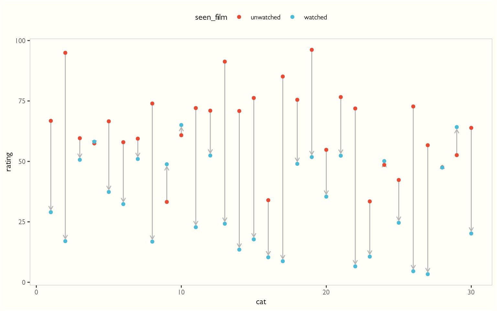
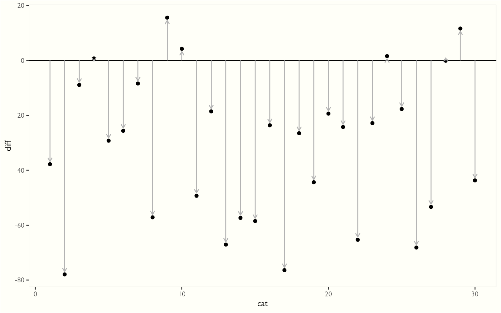
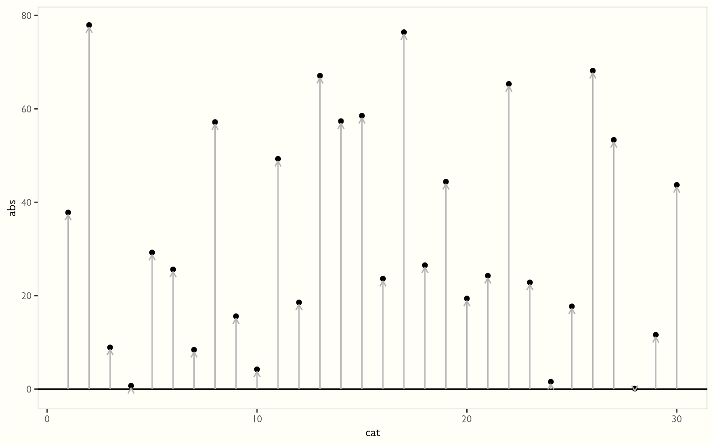
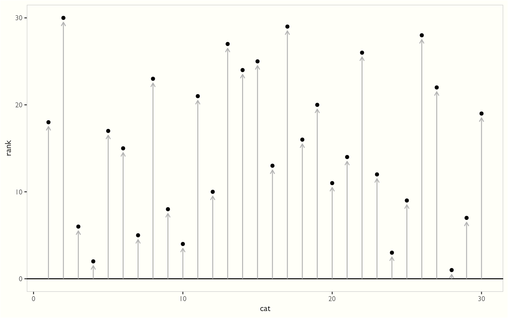
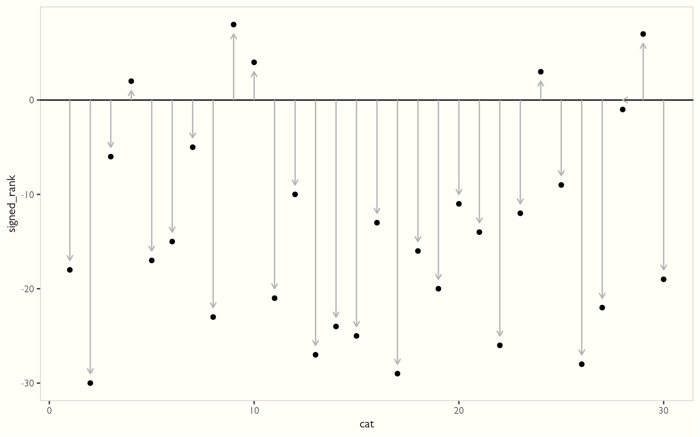

I was tired of looking up what various statistical tests do, so in hopes of remembering, I wanted to try the 'learn by teaching' method. Worse comes to worst, I can just look back at this if need be.

That was five days ago. After five days of looking at poorly scanned PDFs of books published in the last millennium, formulae that look more like hexes than anything else, diving down into the C source code of R, and, of course, plenty of time on Wikipedia - I think I *almost* have a grip as to what's going on.

# Details

Imagine you are trying to train cats to get rid of mice in your house, but they are not good at it. You decide to show them an instructional video called 'Mice are Quite Bad, Actually' and measure their feelings on mice both before and after the movie, on a scale of 1-100 (continuous, not integer. I did this so there would be a very slim chance of there being ties, which is a whole other can of worms).

``` r
library(dplyr)
library(ggplot2)
library(tidyr)
library(ggsci)
library(bladdr)
```

Here's what we're going to use for our cat data:

    # A tibble: 60 × 3
       rating seen_film   cat
        <dbl> <chr>     <int>
     1   66.8 unwatched     1
     2   29.0 watched       1
     3   94.9 unwatched     2
     4   17.0 watched       2
     5   59.6 unwatched     3
     6   50.7 watched       3
     7   57.4 unwatched     4
     8   58.2 watched       4
     9   66.6 unwatched     5
    10   37.4 watched       5
    # ℹ 50 more rows

We have 30 cats, and their feelings on mice before and after they saw our film. But tables are so boring (and difficult to parse) - let's visualize:

``` r
ratings_plotting <- ratings |> 
  group_by(cat) |> 
  mutate(min = min(rating),
         max = max(rating))

wide_ratings <- ratings |> 
  pivot_wider(names_from = seen_film, values_from = rating) 

ggplot(ratings_plotting, aes(cat, rating, color = seen_film)) +
  geom_segment(
    data = wide_ratings, 
    aes(
      y = unwatched, 
      # Give arrowheads more room from the point
      yend = watched - (sign(watched-unwatched)),  
      xend = cat
    ),
    color = "gray70", 
    arrow = arrow(length = unit(5, "pt")
    )
  ) +
  geom_point() +
  theme_tufte(10) +
  scale_color_npg()
```



Notice that your anti-mouse propaganda appears to be working - after the film, cats feelings towards mice were generally less favorable.

You *could* do a t-test, but you don't know if the distribution is normal (actually, I know that the distribution is NOT normal since I generated these data - it uses a uniform distribution)

Let's use a robust test that doesn't assume that the distributions are normal. How does it work? Through the magic of *ranking*.

# Procedure

First, subtract one value from the other. Let's subtract before from after:

``` r
ratings_with_diff <- ratings |> 
  pivot_wider(names_from = seen_film, values_from = rating) |> 
  mutate(diff = watched-unwatched)
ratings_with_diff
```

    # A tibble: 30 × 4
         cat unwatched watched    diff
       <int>     <dbl>   <dbl>   <dbl>
     1     1      66.8    29.0 -37.8  
     2     2      94.9    17.0 -77.9  
     3     3      59.6    50.7  -8.92 
     4     4      57.4    58.2   0.711
     5     5      66.6    37.4 -29.2  
     6     6      58.0    32.3 -25.6  
     7     7      59.4    51.0  -8.41 
     8     8      74.0    16.8 -57.2  
     9     9      33.2    48.8  15.6  
    10    10      60.8    65.1   4.23 
    # ℹ 20 more rows

``` r
ggplot(ratings_with_diff, aes(x = cat, y = diff)) +
  geom_point() +
  theme_tufte(10) +
  geom_hline(yintercept = 0) + 
  geom_segment(
    aes(y = 0, yend = diff - sign(diff), xend = cat), 
    color = "gray70", 
    arrow = arrow(length = unit(5, "pt"))
  )
```



Note that most of the values are negative - again, this shows that most of the cat's views of mice DECREASED after viewing the film.

Now we take the absolute value of these differences:

``` r
ratings_with_abs <- ratings_with_diff |> 
  mutate(abs = abs(diff))
```

``` r
ggplot(ratings_with_abs, aes(x = cat, y = abs)) +
  geom_point() +
  theme_tufte(10) +
  geom_hline(yintercept = 0) + 
  geom_segment(
    aes(y = 0, yend = abs - .5, x = cat, xend = cat), 
    color = "gray70", 
    arrow = arrow(length = unit(5, "pt"))
  )
```



And convert those values to ranks, based on the magnitidue of the differences:

``` r
ratings_with_rank <- ratings_with_abs |> 
  mutate(rank = rank(abs))
```

``` r
ggplot(ratings_with_rank, aes(x = cat, y = rank)) +
  geom_point() +
  theme_tufte(10) +
  geom_hline(yintercept = 0) + 
  geom_segment(
    aes(y = 0, yend = rank - .5, x = cat, xend = cat), 
    color = "gray70", 
    arrow = arrow(length = unit(5, "pt"))
  )
```



Now we give them their signs back:

``` r
ranks_w_sign <- ratings_with_rank |> 
  mutate(signed_rank = rank * sign(diff))
```

``` r
ggplot(ranks_w_sign, aes(x = cat, y = signed_rank)) +
  geom_point() +
  theme_tufte(10) +
  geom_hline(yintercept = 0) + 
  geom_segment(
    aes(
      y = 0, 
      yend = signed_rank - sign(signed_rank), 
      xend = cat
    ), 
    color = "gray70", 
    arrow = arrow(length = unit(5, "pt")))
```



# The Null Distribution

Now here is where things get a little weird: in theory, you would add up all your signed ranks and you'd have your statistic. But under the hood - when using `wilcox.test` - we add up only the positive signed ranks. The reason we can get away with this is because they carry the same information, so long as we know how many numbers were in the original set. For instance, if we had a set of 8 signed ranks, and I showed you this set and said it had all the positive ranks in the original set:

$$
{1, 4, 7}
$$

You could figure out the original set looked like this:

$$
{1, -2, -3, 4, -5, -6, 7, -8}
$$

Why not just use the whole set? As it turns out, calculating the null distribution is pretty hard, but if you only use the positive signed rank distribution as a null distribution (you could technically use just the negative signed rank distribution as well), you can use a recursive formula that makes calculating it semi-tractable.

So, what is this null distribution? In the most general sense, it's the frequency distribution of the statistic you'd get if there was NO effect of showing the video to our cats. With our classic statistic, which is the sum of ALL the signed ranks, we'd expect to get an average of about 0 - the amount of cats who had their views of mice positively impacted - and the magnitude of that impact 0 was about the same as the amount of cats who had their view of mice negatively impacted and the magnitude thereof.

However, this wouldn't be the case with the 'positive rank only' statistic I mentioned we use under the hood - if our statistic was 0 in this case, it would be because NO cats had their views of mice positively impacted by our movie. This is super unlikely in the null case! No, the mean of this 'positive rank only' distribution is:

$$
\frac{n(n+1)}{4}
$$

Why? Well, a fast way to find out what the sum of a sequence of integers...

$$
1, 2, 3, 4, 5, 6, 7, 8, 9, 10
$$

is to essentially fold the number list in half:

$$
1, 2, 3, 4, 5
$$
$$
10, 9, 8, 7, 6
$$
And add the ones on top to the ones below:

$$
11, 11, 11, 11, 11
$$
And then add them all up:

$$
11 + 11 + 11 + 11 + 11 = 11 \times 5 = 55
$$

But we could have made that quicker if we just added the first number (1) to the last number (n) and multiplied it by half the length of the sequence (n/2). Or:

$$
(n + 1) \times \frac{n}{2} = \frac{n(n+1)}{2}
$$

So, the MAXIMUM sum that our 'positive ranks only' statistic could be would be the above, if ALL ranks were positive. The minimum would be 0. And the mean is simply the average between everything and nothing: half.

$$
\frac{n(n+1)}{2} \times \frac{1}{2} = \frac{n(n+1)}{4}
$$

Cool cool. That doesn't help much if you're trying to figure out how this distribution is shaped, which is important if you want to figure out how rare your value is. You just know where the middle is, but you have no idea if the distribution is shaped like a rectangle (a la uniform distribution) or like a sharp needle, that anywhere outside of exactly the center is super rare.

I'll show you how to calculate a small distribution by hand, which I hope will give you an intuition for the mechanics behind this distribution - but I'll show you a far less painless way to do it automatically with R.

We assume that every rank (1, 2, 3, .... n) has an equal possibility of being positive or negative. So our sample space looks like this:

``` r
ss <- expand.grid(`1` = c(-1, 1), 
                  `2` = c(-2, 2), 
                  `3` = c(-3, 3), 
                  `4` = c(-4, 4))
ss
```

        1  2  3  4
    1  -1 -2 -3 -4
    2   1 -2 -3 -4
    3  -1  2 -3 -4
    4   1  2 -3 -4
    5  -1 -2  3 -4
    6   1 -2  3 -4
    7  -1  2  3 -4
    8   1  2  3 -4
    9  -1 -2 -3  4
    10  1 -2 -3  4
    11 -1  2 -3  4
    12  1  2 -3  4
    13 -1 -2  3  4
    14  1 -2  3  4
    15 -1  2  3  4
    16  1  2  3  4

Now, let's add up the POSITIVE ranks for each one of these outcomes:

``` r
outcome_sums <- ss |> 
  mutate(across(everything(), \(x) ifelse(x < 0, 0, x))) |> 
  rowSums()
outcome_sums
```

     [1]  0  1  2  3  3  4  5  6  4  5  6  7  7  8  9 10

And now create a table of the positive rank outcome frequencies:

``` r
table(outcome_sums)
```

    outcome_sums
     0  1  2  3  4  5  6  7  8  9 10 
     1  1  1  2  2  2  2  2  1  1  1 

Look at that! A symmetric distribution with bounds of 0 to n\*(n+1)/2.

Finding the probability of getting a particular value or higher is much simpler: we can sum up the number of outcomes that are higher than our outcome, and divide by the total number of outcomes (2^n). So if the sum of all our positive ranks was 9, we would have a p-value of 1/16 = 0.0625. That is the probability that we would see a value MORE EXTREME than the one we have given random chance. Or, if we had a value of 3 we wanted to know if how extreme that was in terms of being a LOW statistic, we would count the number of outcomes that are LOWER than that (1 + 1 + 1 = 3) divided by the total number of outcomes (p = 3/16 = 0.1875). Again, that is the probability that we would see a value more extreme than the one we have just by random chance.

Thankfully, there are functions in R for this distribution:

``` r
psignrank(9, 4, lower.tail = F)
```

    [1] 0.0625

Now note that the following does not match up with what we calculated:

``` r
psignrank(3, 4)
```

    [1] 0.3125

That is because for `lower.tail = FALSE`, the probability is calculated as the probability of values greater than x (what we did). If `lower.tail = TRUE`, it calculates the probability of values less than *or equal to* x. We just did *less than* for the sake of consistency, but keep this in mind.

# So...back to cats.

To finish off calculating our p-value, we simply sum the *positive* ranks:

``` r
((ranks_w_sign$signed_rank > 0) * ranks_w_sign$signed_rank) |> sum()
```

    [1] 24

And pop it into `psignrank`:

``` r
psignrank(24, 30) # 30 = number of cats
```

    [1] 7.096678e-07

This is exactly the same as R's built in `wilcox.test`:

``` r
wilcox.test(
  ranks_w_sign$watched, 
  ranks_w_sign$unwatched, 
  paired = TRUE, 
  alternative = "less"
)
```


        Wilcoxon signed rank exact test

    data:  ranks_w_sign$watched and ranks_w_sign$unwatched
    V = 24, p-value = 7.097e-07
    alternative hypothesis: true location shift is less than 0

Note that V = 24 (our statistic/the sum of positive ranks) and our p-value matches!

NB: Image of "A photo of a cat watching a documentary about mice" courtesy DALLE-2
