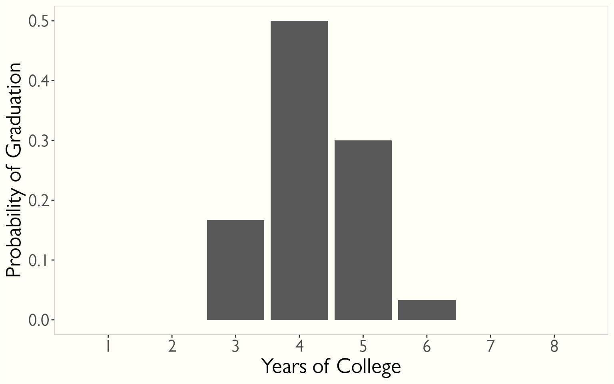
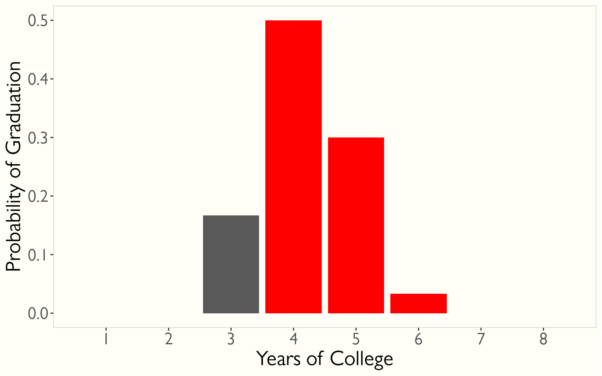
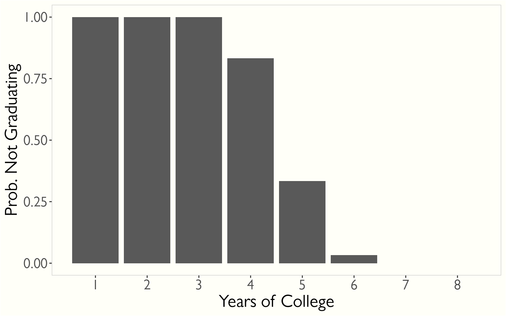
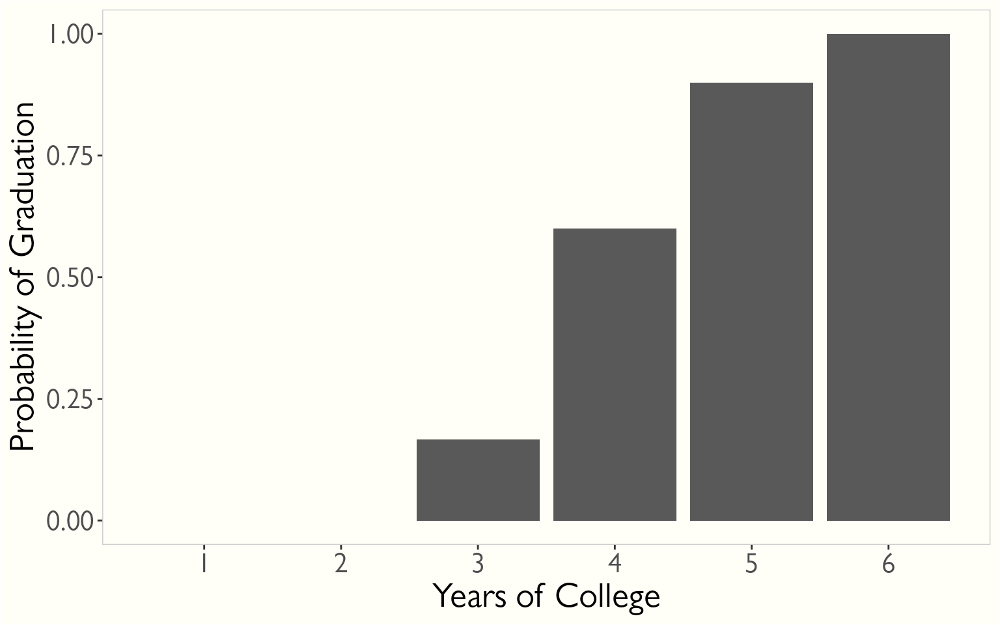
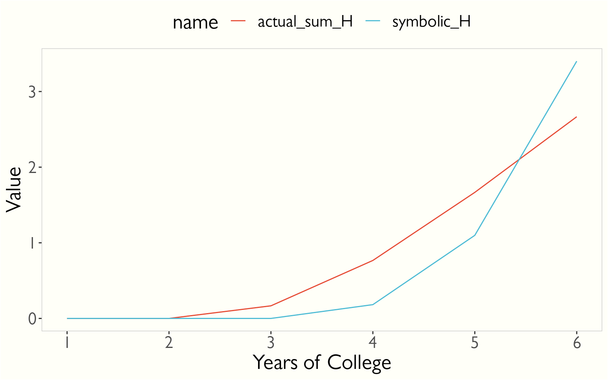

# Introduction

Despite our penchant for measuring time in terms of things like 'seconds', time is continuous - a smear of unidirectional, infinitesimal, temporally flavored jam across the universe. Sometimes, though, time-to-event things happen in more discrete units. Consider graduation time - students tend to graduate yearly, all at the same time (ie graduation day)[^1]. For this section, we're going to describe things in terms of graduation, but you might also consider a 'yearly checkup' to be another case of discrete-time events.

# Old friends in new clothes

## Probability function

We no longer call it a 'probability density function', because it's no longer a density. Instead of the paradoxical '$f(t) = 0$', we now have actual probabilities at a given time, since this time is really more of an interval - what is the probability of graduating 'in the fourth year' rather than what is the probability of graduating 'in 4.0000000... years'.

Here, I've generated *fake* data for graduation times. I just wanted the mode to be around 4 years. I don't even know if that's true or not. It also assumes that no students drop out, which I know is definitely not true. But it's a distribution we're going to stick with for sake of example:

The probability of graduating at your 4th year is 0.5 in this plot. We would say that $p(t_{4})=0.5$. Note that we use $p(t)$ and not $f(t)$ here, in the discrete case.

Our arbitrary probability function is written like this:

$$
p(t_{j})=Pr(T=t_{j})\qquad j=1,2,...
$$

## Survivor Function

The survivor function means the same thing that it did previously, but it needs to be summed instead of integrated[^2].

$$
S(t)=Pr(T≥t)=∑_{j:tⱼ≥t}p(tⱼ)
$$

The colon below the sum means 'such that', just like the bar ( $|$ ) did in our previous section. Why they chose to change it from one to the other in the context of sums, I'm not sure. This means to sum all of the probabilities for each $t$ where the time is greater than or equal to the provided $t$ ( $j:tⱼ≥t$ ).

So, $S(4) = Pr(T ≥ 4)$ - the probability that event (graduation) will happen at year 4 or later, which is the sum of the red bars below:

Plotted, the survivor function looks like this:

## Hazard function

The hazard function in the discrete case is slightly different from the continuous case, as it is a probability rather than just a rate. It functions like the conditional probability we talked about previously. In our case of graduation, it is the probability of graduating in some year, given you haven't already graduated. In math speak, it's:

$$
h(t) = Pr(T = t | T ≥ t)
$$

We can write this in terms of $p(t)$ and $S(t)$, doing the whole Bayes theorem thing again. I'm going to keep it a bit abridged, but if you have trouble following along, read the previous post to see how it was done in the continuous case. In short, you would see the same thing again: $Pr(B|A) = 1$, so $Pr(A|B) = \frac{Pr(a)}{Pr{B}}$.

Since in this analogy,
$$
Pr(A|B) = Pr(T = t | T ≥ t)
$$

and we noted in the above sections that

$$
Pr(A) = Pr(T = t) = p(t)
$$

$$
Pr(B) = Pr(T ≥ t) = S(t)
$$

We can say that

$$
h(t) = \frac{p(t)}{S(t)}
$$

The hazard function looks like this:

Note that it is NOT the same as $F(t)$ (which is $1 - S(t)$) - even though they both approach 1.

There's also a super weird 'cumulative hazard function' for the discrete case, which is not actually a cumulative hazard function. In the continuous case, you can write:

$$
H(x) = -ln(S(x))
$$

So if you just close your eyes and hope for the best, you can generate a symbolically equivalent version in the discrete case by using the discrete functions instead:

$$
H(t) = -ln(S(t))
$$

The problem is that it's not equal to the actual accumulation (that is, the cumulative sum) of the hazard function.

Were I a mathier person I would probably be able to give you a reasonable explanation for why this is. The best I can do is assume that it makes 'some math' easier down the line.

[^1]: I understand that it's possible to graduate in the off season, but let's not make this harder on ourselves

[^2]: You might be able to understand why that if the intervals were short enough, the integral would begin to approximate the sum
