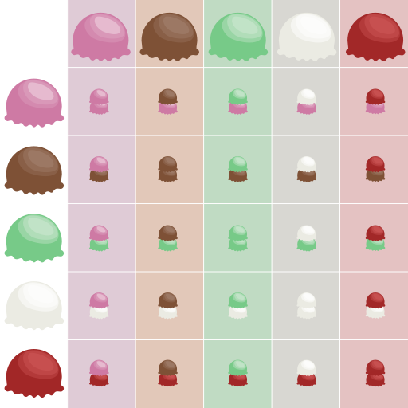

# Purpose

I want to teach you more about J. F. Lawless' Statistical Models and Methods for
Lifetime Data (SMMLD for short), but I need to pick two of the three:

1.  Accessible
2.  Thorough
3.  Succinct

I'm choosing 1 and 2, but that means we're going to have to delve into some
side-quests. You see, the next section of SMMLD involves 'order statistics',
something I've never heard of before. And to explain that, I need to explain the
binomial coefficient. I tried writing an article just on that, but on writing
it, I found I wanted to get a bit deeper into the whys and hows of
combinatorics, too.

So. Here we are. At bedrock. We're going to reason our way from nothing (perhaps
a bit of common sense so we aren't delving into crazy abstract number theory) to
the binomial coefficient.

# Introduction

You have three shirts and two pairs of pants, how many outfits do you have
(disregarding style)? Regardless of how much you know about combinatorics, you
could probably figure out you have 6 possible outfits.

But *why* is that? Sure, you can list out the combinations. You can
probably even crank out a formula to solve the same problem for 300 shirts and
200 pants. But when these problems get more complicated, it can help to have an
intuition of why these formulas work so you can construct your own to apply them
to new scenarios - so that each new scenario doesn't feel like a herculean task,
but rather an incremental addition and application of rules you already know.

# The Addition Principle

You have 5 shirts in your closet and need to choose one. How many options do you
have? 5. A mysterious crate of shirts appears on your doorstep with 3 shirts in
it. If you choose to adopt these 'crate shirts' as your own, how options do you
now have? 8. While this example seems frivolous, this principle is telling us
something important: If you know the number of items in one set (your closet)
and another set (the crate), you don't have to combine them first to know how
many there are (mixing them together doesn't change the number of items). You
can just add the sizes of each set directly.

In math notation, we say:

$$
∣Closet⊔Crate∣ = \sum_{x∈Closet⊔Crate}1 = \sum_{x∈Closet}1 + \sum_{x∈Crate}1 = ∣Closet∣ + ∣Crate∣
$$

Since there's some foreign notation here, let's take some time to pick this
apart. To add up the number of items in a set ($S$) we say:

$$ ∣S∣ = \sum_{x∈S}1 $$

The bars act as a function on the set - a function that gets the number of items
in the set. The right side of the equation essentially iterates over every
element in the set, adding 1 for each item. This is just a formal way of
counting every item in the set.

The $⊔$ symbol is the 'disjoint union' symbol. Essentially, it means to combine
the two sets together (there's a bit of nuance there - check the disjoint unions
section if you're curious)

In summary, the addition principle says that when we have two sets, finding the
size of the combined set is as easy as counting the number in each on
individually. You don't have to mix all your shirts together and then start the
count - you can trust that just counting the ones in the crate and counting the
ones in your closet and adding the results together is equivalent. You can
extend this further to an arbitrary number of sets (ie if you happen to be
receiving boxes of shirts in ever stranger places) by simply adding those as
well.

## Disjoint Unions (Optional)

First off, when a set is 'disjoint' with another set, it means the two have no
elements in common - think non-overlapping circles of a Venn diagram. So, when
we talk about a disjoint union, it can mean a couple things:

1.  A statement: The two sets happened to be disjoint, and we made a union of
    them. For instance, the union of 'Apple, Banana, Pear' and 'Grape, Kiwi, Orange'
    is 'Apple, Banana, Pear, Grape, Kiwi, Orange'
2.  A demand: Modify the input sets so that they WILL be disjoint, then take the
    union. This usually is done by adding a 'label' to each item so we can tell
    where it came from. For example, 'Apple, Banana' and 'Banana, Pear' become
    '(Apple, 0), (Banana, 0)' and '(Banana, 1), (Pear, 1)', which upon the union
    becomes '(Apple, 0), (Banana, 0), (Banana, 1), (Pear, 1)'

In our case, we typically mean the 'demand' version.

# The Multiplication Principle

(I know, these figure styles are all over the place. I don't consider myself
bound by the shackles of 'style' or 'consistency' or 'skill')

Consider the delightful scenario where you are in an ice cream shop with 5
flavors, and you want to make a cone with two scoops of ice cream. Assuming
order matters, and that getting two scoops of the same flavor is valid, how many
2 scoop combinations can you make?

I'm going to call this a problem of 'slots' (not an official term). You have two slots to put an answer into:

1.  What would you like for your first scoop? ______
2.  What would you like for your second scoop? ______

We could apply this to our shirt and pants question at the beginning:

1.  Which shirt do you choose? ______
2.  Which pants do you choose? ______

The important aspects of this is that the slot order matters: strawberry, vanilla is not the same as vanilla, strawberry. This 'slot' framework is useful in that it makes to so 'white shirt, black pants' is a valid choice while 'black pants, white shirt' is not: question 1 asks for a shirt, question 2 asks for pants.

While this is a useful conceptual framework, it doesn't help us calculate the number of possible combinations of ice cream scoops.

I've illustrated all the possible combinations for scoops at the beginning of
this section, and you can see the answer is 25. You'll probably also note that
it's 5×5. You might already be able to formulate the principle in your mind - in
these 'slot' scenarios, you can multiply the number of choices for each slot
together and get the number of total choices. And you'd be right: this is the
multiplication principle. But why is this the case?

The multiplication principle can be thought of as a logical extension of the
addition principle, since when it comes to positive integers, multiplication
tends to just be a fancy notation for addition:

$$ 5×5 = 5 + 5 + 5 + 5 + 5 $$

In terms of our analogy means:

$$ ∣Scoop1∣×∣Scoop2∣ = ∣Scoop1∣×∣Strawberry∣ + ∣Scoop1∣×∣Chocolate∣ + ...$$

This is like finding the area of the picture above by adding one column at a
time.

We see for any column that the second scoop is 'fixed', so the number of
combinations for a column = the number of different first scoops. From there, we
simply use the addition principle to sum each individual column. This 'trick'
can be used for higher dimension decisions as well - such as if you chose three
scoops.

With this, we can prove to ourselves that the size of a product of sets acts
just like we would expect with normal numbers. That is:

$$ ∣Scoop1×Scoop2∣ = ∣Scoop1∣×∣Scoop2∣ $$

The multiplication principle also works if the number of ways to do the first
thing does not change the *number* of ways to do the second thing. For instance,
if we wanted to select two *different* scoops of ice cream, we could choose any
of the 5 scoops for the first, but are limited to 4 options for the second.
Despite our first choice changing the *kinds* of scoops available for the second
choice, it does not change the *number* of scoops available to us. Thus, we can
still use the multiplication principle - meaning we have $5×4=20$ options. We'll
talk about this a little more in the next section.

# Permutations

It's a tale as old as time. You're a powerful wizard and you have several orbs
that you want to arrange on your pedestals in the most pleasing fashion before
company comes over. You have three orbs (the Orb of Seething Fury, the Orb of
Endless Greed, the Orb of Delectable Crumpets) and you needn't display all of
them. How many ways can you arrange your orbs?

The simplest case is to not display any orbs. Perhaps you would feel foolish
flaunting such things to company. But in the case of 0 orbs, you **do** have a
choice, and only one choice.

The next simplest would be to display only 1 orb. For that you have three
options - Fury (F), Greed (G), or Crumpets (C)

$$F, G, C$$

With two orbs, things become interesting. We assume the order matters
(presentation is everything, after all), which leads us with the following
options:

$$FG, FC, GF, GC, CF, CF$$

Supposing you want to flaunt the totality of your wealth, with three orbs, you
have:

$$FGC, FCG, GFC, GCF, CFG, CGF$$

It's important to note (for mathematical reasons) that there are 0 ways to
arrange 4 or more orbs because *you don't have that many*.

When you arrange all of the items in a set (like when we arranged all 3 orbs),
they're usually just called **permutations**. When you select fewer than the
number of items in the set (such as in the case of displaying only 2 of 3 orbs),
they're called r-permutations, where r is the number of items you select (you
may also see them referred to as 'k-permutations').

This orb arranging exercise would quickly become intractable with more than a
few orbs, so we should develop a formula that allows us to calculate the number
of permutations for any given set.

We can use what we know about the multiplication principle to prove this. Let's
start with an example that would be too cumbersome to write out, so we're forced
to find a better way to calculate our answer. Let's assume 10 orbs.

As we mentioned in the product rule, the multiplication principle also holds
even if the previous task affects (selecting the previous orb, for instance) the
current task (selecting the current orb), so long as the *number* of options
remains the same. We might not be able to use the multiplication principle if,
say, selecting the Orb of Extraordinary Beauty prohibited us from displaying the
Orb of Unsightly Boils (meaning that the number of orbs available to us was
different depending on the orb selected), but we assume there are no such cases
here.

When we choose the first orb, we have 10 options. When we choose the second orb,
we have 9 options (no matter the first orb we picked!). We continue down the
line until we reach only 1 orb left.

Using the multiplication principle, we know that we can simply multiply these
numbers (10, 9, 8, 7, ...) together to get the number of orb arrangements
available to us. Multiplying decreasing numbers like this is so common that it
has its own notation, and is known as a 'factorial'. So, for instance,
$5×4×3×2×1$ is written as $5!$ and is pronounced 'five factorial'. (Aside: $0! =
1$. Why? Because there is only one way to arrange 0 things.)

Now let's consider cases where we have more objects that places to put them. For
example, if we only had 2 slots to display orbs, we would have $10×9$
permutations (10 orbs could go in the first slot, 9 could go in the second). We
can say this more succinctly and generally with the following formula:

$$
P(n,r) = \frac{n!}{(n-r)!}
$$

Where $n$ is the number of objects, and $r$ is the number of 'slots'. Looking at it, this equation automatically cancels out any 'choosing rounds' we
don't have slots for by dividing by $(n-r)!$.

# Subsets, and the binomial coefficient (at long last)

Oftentimes we don't care about the order of the selection of items, we just care
about which items were selected. In our ice cream example, this would be like if
they were going into a shake: order doesn't matter, only content. We call these
order-agnostic selections 'subsets'.

This makes counting things a bit more challenging, though. No longer does 'Mint,
Strawberry' differ from 'Strawberry, Mint'. For me, this get increasingly
complicated to reason about beyond two items. We can use the math we have
developed previously to guide us to a conclusion that intuition alone may
struggle to get us to.

We can consider finding the number of r-permutations to be two steps:

1.  Find the number of r-**subsets**
2.  Find the number of ways to arrange the items within each of those subsets.

We know that that the number of permutations of a subset shouldn't matter
*which* items we select for a subset, implying we can use the multiplication
principle. So our formula should look something like:

Number r-permutations from an n-element set = Number r-subsets from an n-element
set × Number r-permutations from an **r-element** set

That's quite wordy. We know some notation, so let's use it:

$P(n,r)$ = Number r-subsets from an n-element set × $P(r,r)$

'Number r-subsets from an n-element set' is *also* wordy and frequently used
enough that it has its own notation:

Number r-subsets from an n-element set = $\binom{n}{r}$

This is pronounced as 'n choose r'.

So now we have:

$$P(n,r) = \binom{n}{r} × P(r,r)$$

We should first note that we can simplify $P(r,r)$:

$$P(r,r) = \frac{r!}{(r-r)!} = \frac{r!}{0!} = \frac{r!}{1} = r!$$

So:

$$P(n,r) = \binom{n}{r} × r!$$

We can solve for our unknown:

$$
\binom{n}{r} = \frac{1}{r!} × P(n,r) = \frac{1}{r!} × \frac{n!}{(n-r)!} = \frac{n!}{r!(n-r)!}
‌$$

And *this* - $\binom{n}{r}$ - is the binomial coefficient. Congratulations - we
proved this to ourselves. You should feel good, because honestly I felt quite
proud and it's embarrassing if I'm the only one.

The next post will be about the interpretation and application of the binomial coefficient.

# Summary

- Addition principle says $∣A+B∣ = ∣A∣ + ∣B∣$
- Multiplication principle says $∣A×B∣ = ∣A∣ × ∣B∣$
  - Only applies to 'independent' events (see text for nuance)
- Permutations are selections from a set where order matters
- Subsets are selections from a set where order is meaningless
- The number of unique subsets in a set of size $r$ in a set of size $n$ is given by the binomial coefficient.
- The binomial coefficient is denoted by $\binom{n}{r} = \frac{n!}{r!(n-r)!}$

# I want more

I highly recommend 'Introductory Combinatorics' by Richard A Brualdi, which as
far as I have read is a very humane treatment of combinatorics. A **lot** of the
content/structure here is based on that book. Please check it out!

# References

-   Introductory Combinatorics, 5th edition, by Richard A Brualdi
-   <https://planetmath.org/EnumerativeCombinatorics> - Proof from addition to multiplication principle
-   <https://en.wikipedia.org/wiki/Disjoint_union> - A disjoint union is basically a union that denotes set provenance
-   <https://math.stackexchange.com/questions/1631396/what-is-the-difference-between-disjoint-union-and-union>
-   <https://en.wikipedia.org/wiki/Bijection> - Bijection - a one-to-one function, where every element in one set has exactly one element in the other.
-   <https://en.wikipedia.org/wiki/Cartesian_product>
