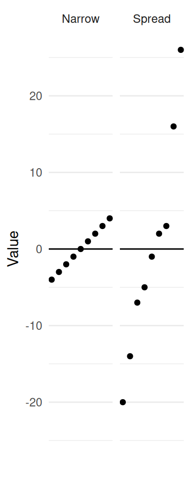
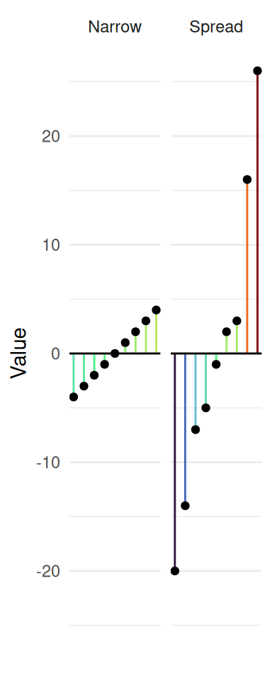
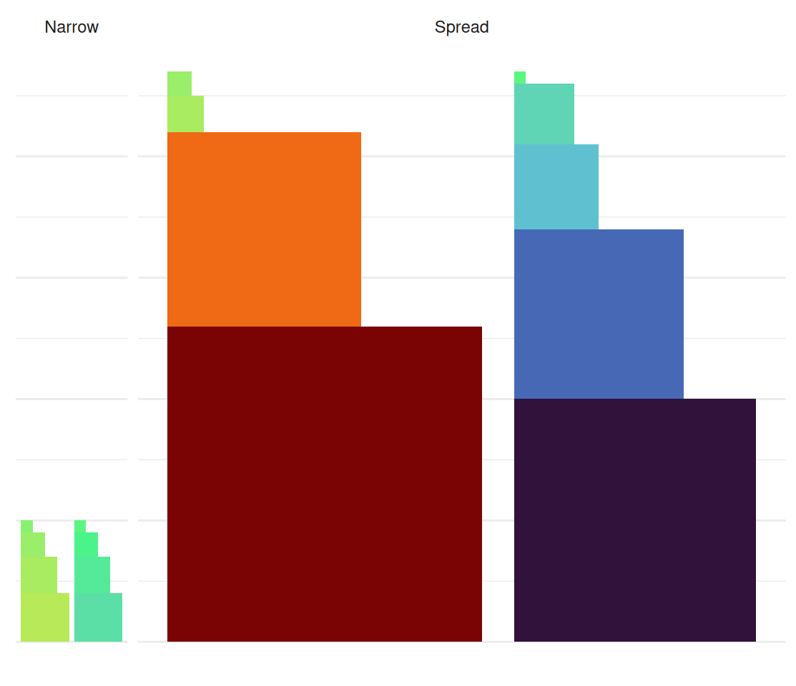
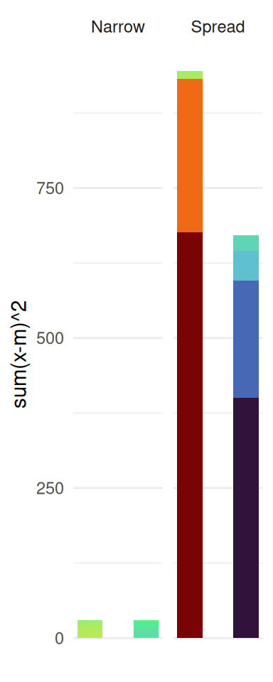
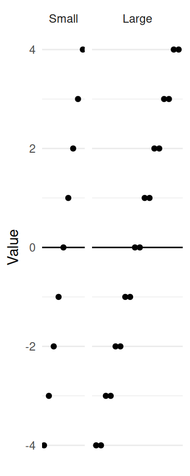
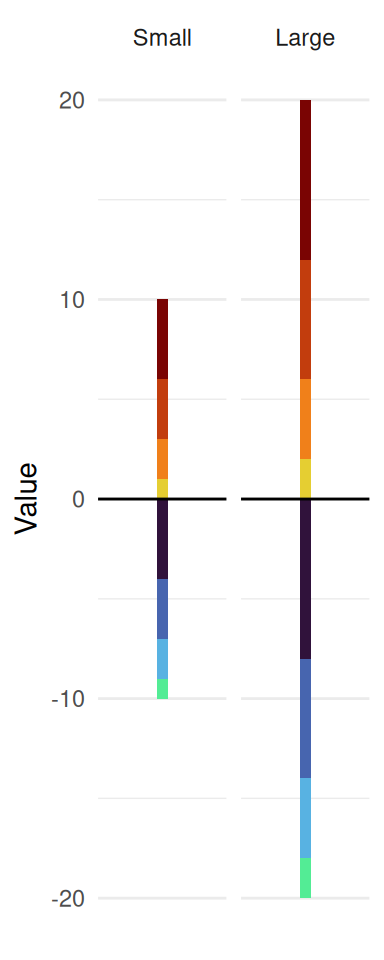

``` r
library(tidyverse)
```

## Introduction

I use standard deviation all the time - usually only transiently, say for
hypothesis testing. I was writing a blog post where I decided to do a little
explainer for standard deviation in the middle, and then realized (as often
happens) that I don't know nearly as much as I thought I did.

In this post I'm going to talk a little bit about deviation - mostly about why
the standard deviation is calculated the way it is. In future posts, I'll cover
why we don't (or sometime do) use other measures of deviation, and some
properties of each of these metrics.

## Standard Deviation: Definitions, Uses

Even though we're going to go to some weird places in this post, let's start off
with something familiar. The formula for standard deviation of a population is
as follows:

$$SD = \sqrt{\frac{1}{n} \sum_{i = 1}^{n}(x_{i} - \mu)^2}$$

Where $n$ is the number of items in the sample, $x_{i}$ is the $i$th value of some random variable $X$, and $\mu$ is the population mean.

But frankly, as someone who understands R a bit better than math, I'd prefer to read something like this:

``` r
mu <- mean(x)
sqrt(mean((x - mu)^2)) # sum(x)/length(x) = mean
```

Even still, *why* this formula the way it is isn't immediately obvious.

First of all, why do we care about measuring deviance?

Deviance is a good thing to measure: it's a measure of how squirrely the numbers are. For instance, it tells us a little bit about the reliability of a value. If we know that our weatherman is *on average* correct, but his variability is huge, you might prefer a weatherman who - while not entirely accurate - won't tell you that it's going to be 1000F out today, up from yesterdays -900F.

## Developing SD From Ground Up

Here's a plot of two sets of data, both with a mean of 0:






Immediately, you can tell that one is spread out more than the other. It would be nice to be able to describe this spread in a mathematical way.

Let's assume, first, that standard deviation doesn't exist, and we'd like to develop our own definition. If I were looking at this, my first instinct might be to measure the distance each one of the points was from the 'middle'. In this case, let's choose the mean to be the middle.

If we draw a line from each point to the center (which - again - is 0 because the mean of each distribution is 0 and we're calling that 'center'), we get something like in the second panel.

If I were trying to come up with this, I might first try to sum up all the distances together, but I would be WRONG. The sums cancel out (third panel).

My immediate next idea would probably be to take the absolute value. And in fact, trying to figure out why we *don't* do that was part of what inspired me to make this post. Let's put a pin in that for now - I'll get to it in my next post. As for now, let's do something similar: square all the values.



Okay, while cute, this is a bit hard to interpret - so I'm going to smoosh them to make them all have a width of 1 so we can compare them just based on height. Before that, though, take a moment to see that we're getting closer to something that might be useful: there's clearly more 'stuff' on the right than on the left, and this appears to be reflecting the 'squirreliness' of the data we noticed earlier.

Looking at our data in a less literal, but more interpretable way:



One thing you might notice is that although the differences between the unsquared differences from the mean cancel out, the squared differences aren't necessarily the same! Notice how the positive differences in the "spread" distribution are larger than the negative differences.

While we're certainly moving in the right direction, there's a teeny little problem that we might catch if we continue playing with different datasets. What about these two, where the two datasets are the same, except one dataset has every value twice:






We can see from this that even though that we essentially sampled from the same data twice, our metric shows us *more* variability. Intuitively, this doesn't seem to be a very good metric, since it will always grow with the number of measurements we take, rather than anything intrinsic about the distribution.

An easy solution is to scale the amount each value contributes by some number. We can do that my taking the mean of all the measurements, or multiplying each measurement by $1/n$:


Look at that! They're the same now, which squares with our intuition: if we keep sampling from a population and it keeps returning similar measurements, we wouldn't expect our measurement of variability to change much, if at all. By the way, to get your bearings: what I'm showing you above is the variance of the samples, just separated by initial value sign before squaring.

There's just one final issue that might not be immediately noticeable: units.

In practice, we're usually measuring *something* - say, the number of apples per harvest - that have some unit (apples). When we perform the transformations as we've done above, we're left with squared units (so, apples^2). Apples^2 doesn't make any sense[^1]. Taking the square root of the value not only helps make the *unit* more interpretable, but also makes the *value* a bit more interpretable too: it gives you an estimate on a normal amount of deviation from the mean you'd expect to see.

However, you might be thinking that this all feels a little complicated - particularly if we could have just taken the absolute value of the differences, and then we would have any squaring to un-square. And you'd be right! I'll get a little but more into the pros and cons of different methods of measuring and reporting variability in the next post.

[^1]: if anything, they're more spherical
