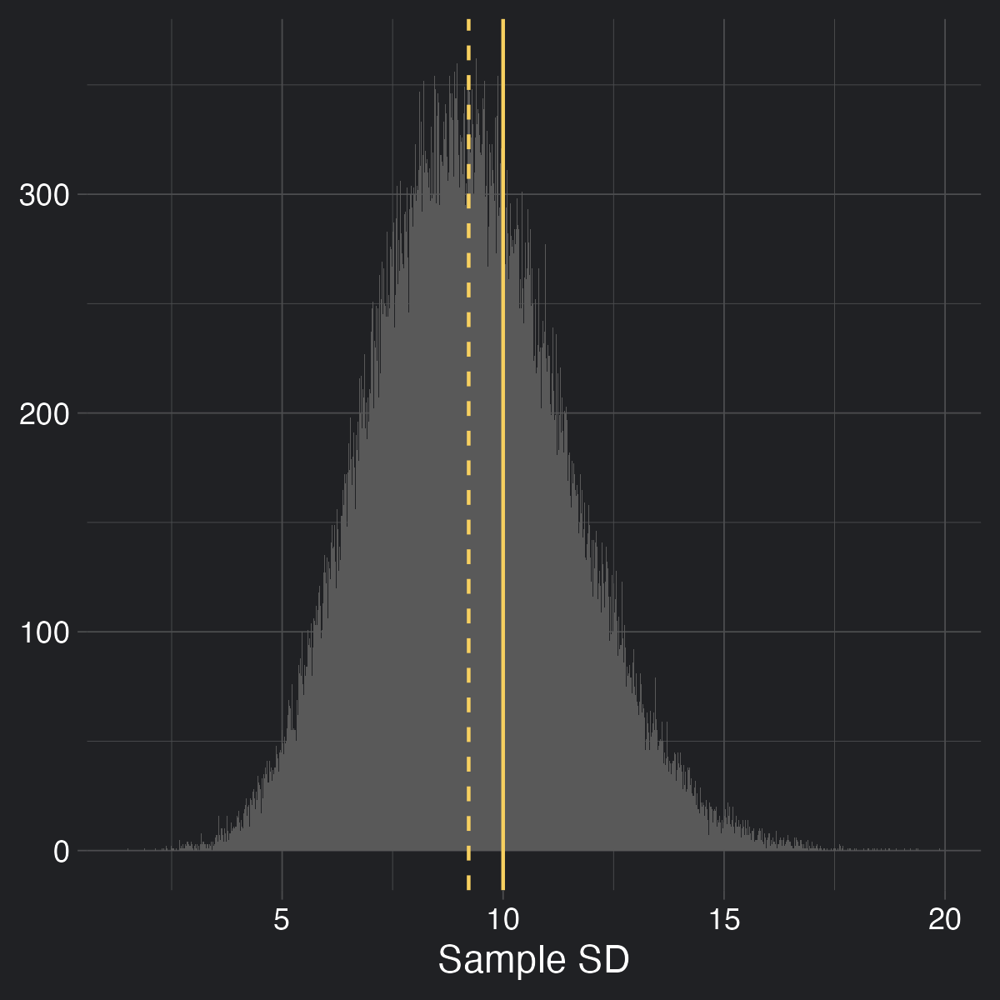

``` r
library(tidyverse)
library(kaimeleon)
ACCENT <- "#f7d060"
```

# Introduction

In previous blog posts [[1](https://kai.rbind.io/posts/2024-09-22_deviation-deep-dive-pt1/)] [[2](https://kai.rbind.io/posts/2025-01-06_deviation-deep-dive-pt2/)], I've alluded to the fact that when we calculate the standard deviation, we sometimes divide by $n - 1$ (that is, one less than the number of samples we have) rather than $n$. This is known as 'Bessel's correction', and it's typically sneaked in after learning how to calculate the standard deviation, hopefully quickly enough so you won't notice. However, I think it's fairly common to ask why we do this, and the standard response is usually a mumbling answer along the lines of it being a correction factor, and that you should only do it if you're estimating the standard deviation from a sample rather than using the whole population, turning this corrective factor not only into a mysterious oddity, but now also part of a shadowy ritual. My thoughts to this answer were typically 'correction for what?' and 'wow that seems pretty haphazard', and usually resulted in me always dividing by $n-1$ and hoping nothing bad would happen.

During my quest for enlightenment, I came across several different explanations, with varying levels of detail and coherence, which I'll explain back to you in order of increasing detail. I very much regret this endeavor.


# Conventions

Unfortunately, this blog post is going to contain some math. Instead of breaking up proofs by saying 'and we can do this step because of XYZ' which can make following along difficult, I'm doing to include symbols above equals signs that will direct you to a section in the appendix that should show you why this is possible. For instance:

\begin{align*}
E[A + B] \overset{1}= E[A] + E[B]
\end{align*}

Where 1 corresponds to the number in the appendix.

Also, I tried my best to use colors in equations to draw your attention to the changing parts. Apologies if it's distracting. I find my eyes glaze over pretty quickly if they don't have 'landmarks'.

Finally, I've chosen to collapse code that I didn't find pertinent to the lesson at hand, but feel free to expand it if you're interested!


# Explanation I: It just works, OK?

The first and easiest way to look at this is to simply *not* look at it, a tactic similar to the 'it's working don't touch it' strategy I take with particularly arcane sections of code. So maybe we should kick the tires and make sure this thing is even working in the first place. It certainly would be convenient if we didn't actually need this thing in the first place.

Let's simulate some samples:

``` r
set.seed(13)
replicates <- 100000
n <- 10
sd <- 10
samples <- replicate(replicates, rnorm(n, sd = sd), simplify = FALSE)

```

And let's plot some samples to wrap our head around them:

<details>
<summary>Plotting code</summary>

``` r
some <- 20
plotting_data <- data.frame(
  value = unlist(samples[seq_len(some)]),
  replicate = factor(rep(seq_len(some), each = n))
)
ggplot(plotting_data, aes(value, replicate, color = 1)) +
  geom_vline(xintercept = 0, color = "white", linewidth = 0.2) +
  geom_point(shape = 1) +
  theme_kai("dark") +
  theme(
    legend.position = "none",
    axis.text.y = element_blank(),
    panel.grid.minor = element_blank()
  ) +
  labs(x = NULL, y = "Replicate")
```
</details>


Each replicate has 10 values in it, sampled from a normal distribution with a mean of 0 and a standard deviation of 10.

However, just because it was *sampled* from a distribution with those parameters doesn't mean that the *samples themselves* will have those parameters on average (that is to say, the sampling distribution isn't guaranteed to have a mean equal to the population statistic, aka [bias](https://en.wikipedia.org/wiki/Bias_of_an_estimator)), so let's check it out:

``` r
# We're creating our own functions because R's automatically applies Bessel's
# correction
calc_var <- function(values, center = mean(values)) {
  n <- length(values)
  sq_diffs <- (values - center)^2
  sum(sq_diffs/n)
}
calc_sd <- function(values, center = mean(values)) {
  sqrt(calc_var(values, center))
}

sds <- sapply(samples, calc_sd)
```

<details>
<summary>Plotting code</summary>

``` r
plot <- ggplot(data.frame(x = sds), aes(x)) +
  theme_kai() +
  geom_histogram(bins = 1000) +
  geom_vline(xintercept = sd, color = ACCENT) +
  geom_vline(xintercept = mean(sds), color = ACCENT, linetype = 2) +
  labs(x = "Sample SD", y = NULL)
ggsave("sds.png", plot, dpi = 300, width = 4, height = 4, units = "in")
```
</details>


In this figure I'm showing the distribution of the calculated sample standard deviations (without correction!!) for all 100,000 samples. The dotted line represents the mean of the sampling distribution, while the solid line represents the true population standard deviation. As you can tell, it's being a bit underestimated.

What about if we use Bessel's correction?

``` r
# Using R's built-in sd function, which applies Bessel's correction
sds <- sapply(samples, sd)
```
    
<details>
<summary>Plotting code</summary>

``` r
plot <- ggplot(data.frame(x = sds), aes(x)) +
  theme_kai() +
  geom_histogram(bins = 1000) +
  geom_vline(xintercept = sd, color = ACCENT) +
  geom_vline(xintercept = mean(sds), color = ACCENT, linetype = 2) +
  labs(x = "Sample SD", y = NULL)
ggsave("sds_w_bessel.png", plot, dpi = 300, width = 4, height = 4, units = "in")

```
</details>


This helps quite a bit (though it isn't perfect).

For leading and didactic reasons, let's also look at the distributions of the sample variances without and with Bessel's correction:

``` r
vars <- sapply(samples, calc_var)
```

<details>
<summary>Plotting code</summary>

``` r
plot <- ggplot(data.frame(x = vars), aes(x)) +
  theme_kai() +
  geom_histogram(bins = 1000) +
  geom_vline(xintercept = sd^2, color = ACCENT) +
  geom_vline(xintercept = mean(vars), color = ACCENT, linetype = 2) +
  labs(x = "Sample Variance", y = NULL)
ggsave("vars.png", plot, dpi = 300, width = 4, height = 4, units = "in")
```
</details>


``` r
vars <- sapply(samples, var)
```
    
<details>
<summary>Plotting code</summary>

``` r
plot <- ggplot(data.frame(x = vars), aes(x)) +
  theme_kai() +
  geom_histogram(bins = 1000) +
  geom_vline(xintercept = sd^2, color = ACCENT) +
  geom_vline(xintercept = mean(vars), color = ACCENT, linetype = 2) +
  labs(x = "Sample Variance", y = NULL)
ggsave("vars_w_bessel.png", plot, dpi = 300, width = 4, height = 4, units = "in")
```
</details>


You'll notice that while the sample variance consistently underestimated the population variance before Bessel's correction, it lined up nearly exactly after we used Bessel's correction. We are forced to agree that Bessel's correction is doing *something* good, and is worth investigating further.


# Explanation II: It accounts for reusing data

Besides the explanation of 'it just does work, do it' (which is, admittedly, not an explanation but rather a motivation), we can explain Bessel's correction in terms of combating 'data-reuse'.

When calculating the standard deviation, we find the differences between the mean and a given value. No worries if we know the mean of the population, but in my forays with statistics this is an incredibly rare scenario. Much more likely is that we are forced to use the mean of the *sample*, then estimate the population standard deviation using the differences of the values of the sample and the mean of the sample.

As we explored a bit in [the first blog post of this series](https://kai.rbind.io/posts/2024-09-22_deviation-deep-dive-pt1/), variance is defined in large part by the distances of the values from the mean, usually either the sample mean or the population mean. As it turns out, the variance is minimized when that value is the mean of the sample.


## Wait, I don't believe you

That's fine. I didn't believe it either. But it turns out that some fairly harmless algebra can be used to show this is true.

(NB: This section is *optional*. If you choose to believe me (foolish) that the point at which to take distances from for variance is minimized by using the sample mean, you can move to the next section. Otherwise, read on.)

The definition of variance is:

\begin{align}
Var(X) := E\big[(X-\bar{X})^2\big]
\end{align}

That is, variance is the average of the squared differences between the random variable $X$ and its mean (aka expectation, $E[X]$, denoted by $\bar{X}$).

One way to determine if $\bar{X}$ will result in the smallest $Var(X)$ is to assume that maybe some other constant (let's call it $c$) would be better. That is, what is this:

\begin{align}
E\big[(X-c)^2\big]
\end{align}

One clever trick we can do to get this in terms of the variance definition we know and love is to add and subtract $\bar{X}$ to this equation (effectively adding 0, maintaining equality):

\begin{aligned}
\newcommand\xb{\bar{X}}
\newcommand\a{\textcolor{red}{(X-\xb)}}
\newcommand\b{\textcolor{blue}{(\xb - c)}}
E\big[(X-c)^2\big] &= E\big[(X \textcolor{goldenrod}{ - \xb + \xb} - c)^2\big] \\\
&= E\Big[\big(\a + \b\big)^2\Big] \\\
&= E\big[\a^2 + 2\a\b + \b^2\big] \\\
&\overset{1}= E[\a^2] + E[2\a\b] + E[\b^2]
\end{aligned}

Since $\bar{X}$ and $c$ are constants, $E[\bar{X}]$, $E[c]$, and $E[\bar{X} - c]$ will be just be $\bar{X}$, $c$, and $\bar{X}-c$

\begin{aligned}
\newcommand\xb{\bar{X}}
\newcommand\a{(X-\xb)}
\newcommand\b{(\xb - c)}
\newcommand{\hl}[1]{{\color{goldenrod}{#1}}}
E\big[(X-c)^2\big] &= E[\a^2] + E[\hl{2}\a\hl{\b}] + E[\hl{\b^2}] \\\
&= E[\a^2] + 2\b E[X - \hl{\xb}] + \b^2 \\\
&\overset{1}= E[\a^2] + 2\b(E[X] - \xb) + \b^2
\end{aligned}

Also, since $E[X] := \bar{X}$,

\begin{aligned}
\newcommand\xb{\bar{X}}
\newcommand\a{(X-\xb)}
\newcommand\b{(\xb - c)}
\newcommand{\hl}[1]{{\color{goldenrod}{#1}}}
E\big[(X-c)^2\big] &= E[\a^2] + 2\b(\hl{\xb} - \xb) + \b^2 \\\
&= E[\a^2] + \hl{0} + \b^2 \\\
&= E[\a^2] + \b^2 \\\
\end{aligned}

We can see that the first term is our original definition of variance. The second term is squared and therefore can only be positive. At best, it can be 0, which only happens when $c = \bar{X}$. Therefore, variance is minimized when the thing we're measuring distances from is the mean of $X$.


## Okay, I believe you

Since you either blindly believe me or have been convinced that measuring all the distances from the sample mean results in the smallest variance, we can now consider the implications.

For any given sample, the sample mean will almost never be the population mean. If the sample mean will always give the lowest variance, the population mean (the thing we would use to estimate population variance if we knew it because it gives us an unbiased result) will always give a higher variance (except in the case in which it is exactly equal, which is unlikely).

Intuitively, this has been described as painting a target around a bunch of bullet holes, rather than shooting at a target. You're peeking at the future and then wondering why you're correct all the time.

This is usually where the concept of 'degrees of freedom' gets invoked. If someone tells you that you can pick any 5 numbers, so long as they have a mean of, say, 20, you're free to do whatever you want to do with 4 of them - but that last one has to pick up the bill to get the mean to be 20. That is, there are only 4 values that are 'free to vary' - only 4 *degrees of freedom*.

This is true for an arbitrary mean and an arbitrary number of values - you will always have $n-1$ degrees of freedom if you are calculating a new statistic reusing old information (in the case of sample variance, the sample mean isn't truly free to vary: it is bound by the sample). So it's kind of like instead of having $n$ values, you have $n-1$ values. Dividing by this inflates the variance a bit to combat the artificial deflation, and all is well in the world. Right?

# Explanation III: For those suspicious of simplicity

$n - 1$ feels pretty dang neat. *Too* neat. To rigorously prove that dividing by $n-1$ rather that $n$ provides the correction we need, we can pay our dues with math.

Gregory Gundersen (who has a [very nice blog](https://gregorygundersen.com/)) has a [post](https://gregorygundersen.com/blog/2019/01/11/bessel/) proving Bessel's correction that I'm largely going to follow, expounding on points I found confusing (not due to Gregory but rather my own knowledge gaps. I also tend to write the individual steps out more to hopefully reduce your cognitive overhead).

The sample variance $s^2$ is defined by

$$
s^2 := \frac{1}{n}\sum^n_{i=1}(X_i - \bar{X})^2
$$

Note that compared to $\sigma^2$ (the population variance), $s^2$ measures the difference between values and the sample mean ($\bar{X}$) rather than the population mean ($\mu$).

Our goal, ultimately, is to find  $E[s^2]$ in terms of $\sigma^2$ and then see by how much it differs, and if that difference corresponds with Bessel's correction.

\begin{align*}
\newcommand\sm{\sum^n_{i=1}}
\newcommand\fr{\frac{1}{n}}
\newcommand\xb{\bar{X}}
\newcommand{\hl}[1]{{\color{goldenrod}{#1}}}
E[s^2] &= E[\hl{\fr} \sm(X_i - \xb)^2]\\\
&\overset{1}= \hl{\fr} E[\sm(X_i - \xb)^2]\\\
&= \fr E[\sm X_i^2 + \sm(\hl{-2}X_i\hl{\xb}) + \hl{\sm \xb^2}]\\\
&= \fr E[\sm X_i^2 - \hl{2\xb}\textcolor{blue}{\sm X_i} + \hl{n\xb^2}]\\\
&= \fr E[\sm X_i^2 - 2\xb\textcolor{blue}{n\xb} + n\xb^2]\\\
&= \fr E[\sm X_i^2 - 2n\xb^2 + n\xb^2]\\\
&= \fr E[\sm X_i^2 - n\xb^2]\\\
&\overset{1}= \fr \Big(E[\sm X_i^2] - E[\hl{n}\xb^2]\Big)\\\
&\overset{1}= \fr \Big(E[\sm X_i^2] - \hl{n}E[\xb^2]\Big)\\\
&= \fr E[\sm X_i^2] - E[\xb^2]\\\
&\overset{1}= \fr \sm E[X_i^2] - E[\xb^2]\\\
&= \textcolor{red}{E[X_i^2]} - \textcolor{blue}{E[\xb^2]}\\\
\end{align*}

Since

\begin{align*}
Var(X) \overset{2.1}= E[X^2]- E[X]^2
\implies E[X^2] = Var(X) + E[X]^2
\end{align*}

Substituting $X$ for $X_i$ gets us

\begin{align*}
\color{red}{E[X_i^2]} \color{white}{= Var(X_i) + E[X_i]^2}
\end{align*}

$Var(X_i) = \sigma^2$ and $E[X_i] = \mu$ (note that $X_i$ is not a value but rather the process of drawing a single value, so this equality still holds), so

\begin{align*}
\textcolor{red}{E[X_i^2]} &= Var(X_i) + E[X_i]^2 \\\
&= \sigma^2 + \mu^2
\end{align*}

Using the same equation above but substituting $\bar{X}$ for $X$ instead of $X_i$ for $X$, we get:

\begin{align*}
\textcolor{blue}{E[\bar{X}^2]} = \textcolor{green}{Var(\bar{X})} + E[\bar{X}]^2
\end{align*}

$Var(\bar{X})$ is a bit different than $Var(X_i)$, but can be simplified like so:

\begin{align*}
\textcolor{green}{Var(\bar{X})} &= Var(\frac{1}{n}\sum^n_{i=1}X_i) \\\
&\overset{2.2}= \frac{1}{n^2}Var(\sum^n_{i=1}X_i) \\\
&\overset{2.3}= \frac{1}{n^2}\sum^n_{i=1}Var(X_i) \\\
&= \frac{1}{n^2}\sum^n_{i=1}\sigma^2 \\\
&= \frac{n\sigma^2}{n^2} \\\
&= \frac{\sigma^2}{n}
\end{align*}

Plugging this back into the equation, we get:

\begin{align*}
\textcolor{blue}{E[\bar{X}^2]} &= \textcolor{green}{Var(\bar{X})} + E[\bar{X}]^2 \\\
&= \textcolor{green}{\frac{\sigma^2}{n}} + E[\bar{X}]^2 \\\
&= \frac{\sigma^2}{n} + \mu^2 \\\
\end{align*}

So, substituting these for $E[X_i^2]$ and $E[\bar{X}^2]$, we get

\begin{align*}
E[s^2] &= \textcolor{red}{E[X_i^2]} - \textcolor{blue}{E[\bar{X}^2]} \\\
&= \textcolor{red}{(\sigma^2 + \mu^2)} - \textcolor{blue}{(\frac{\sigma^2}{n} + \mu^2)} \\\
&= \sigma^2 - \frac{\sigma^2}{n} \\\
&= \sigma^2 (1-\frac{1}{n}) \\\
&= \sigma^2 \frac{n-1}{n}
\end{align*}

Rearranging this equation, we get:

\begin{align}
E[s^2] &= \sigma^2 \frac{n-1}{n} \implies \\\
\sigma^2 &= \frac{n}{n-1}E[s^2]
\end{align}

That is to say, rather than divide by $n$ (undo dividing by $n$ by multiplying it) divide instead by $n-1$. This is Bessel's correction. Was it worth it??? All the suffering????

# Do we need Bessel's correction at all?

'It depends'. Of course it does. Bessel's correction removes bias (that is, the difference between the true statistic and the mean of the distribution of estimated statistics) for variance, so in the case where theoretical perfection is required, this might be preferred. Indeed, the theory behind it is pretty interesting! However, it doesn't completely remove bias in the case of standard deviation (as we saw in some of our first plots), and it's frankly confusing as hell. Jeffery Rosenthal wrote a [beautiful article](https://imstat.org/2015/11/17/the-kids-are-alright-divide-by-n-when-estimating-variance/) summarizing the challenges of teaching Bessel's correction, and mentioned that the smallest mean-squared-error results not from dividing by $n-1$, or even $n$, but $n+1$. As such, it might be best to leave Bessel's correction as a theoretical curiosity for more advanced studies, stick with dividing by $n$ for didactic purposes, and $n+1$ for applications that require the smallest MSE. However, I hope this post at least helps explain the why and how $n-1$ came to be in the first place, since it is still very much present.

# Appendix

## Random Variable

A random variable isn't really random nor is it really a variable. There are a lot of people smarter than me that would quibble with this definition, but a random variable is probably better described as a function that takes some result of an event (a roll of a die, a flip of a coin, a heart rates measurement) and turns it into a number (in the case of a die roll and heart measurement, the conversion is pretty obvious. For heads and tails, one of them is probably going to be 1, one is probably going to be 0, and the random variable does the conversion).

Just like a function doesn't have a value until called with an argument, a random variable doesn't have a value until it is realized.


<a id="org48f5bf6"></a>

## (1) Linearity of Expectation

Expectation (which for our purposes is identical to the mean) of a random variable has the following definition:

\begin{equation}
E[X] = \frac{1}{n}\sum^{n}_{i = 1}X_i
\end{equation}

It has some algebraically useful properties, namely:

\begin{equation}
E[aX] = aE[X]
\end{equation}

where $a$ is some constant, and

\begin{equation}
E[X + Y] = E[X] + E[Y]
\end{equation}

An extension of this is that

\begin{equation}
E[\Sigma X] = \Sigma E[X]
\end{equation}


<a id="orgcedb94a"></a>

### Proof

We can show this using the definition of the mean:

\begin{align*}
E[aX] &= \frac{1}{n}\sum^{n}_{i = 1}aX_i\\\
&= \frac{1}{n}(aX_1 + aX_2 + ... + aX_n)\\\
&= a\frac{1}{n}(X_1 + X_2 + ... + X_n)\\\
&= aE[X]
\end{align*}

\begin{align*}
E[X + Y] &= \frac{1}{n}\sum^{n}_{i = 1}(X_i + Y_i)\\\
&= \frac{1}{n}(X_1 + Y_1 + ... + X_n + Y_n)\\\
&= \frac{1}{n}[(X_1 + ... + X_n) + (Y_1 + ... + Y_n)] \\\
&= \frac{1}{n}(X_1 + ... + X_n) + \frac{1}{n}(Y_1 + ... + Y_n) \\\
&= E[X] + E[Y]
\end{align*}


## (2) Variance

### (2.1) Rearrangement

Turns out,
$$
Var(X) = E[(X-\bar{X})^2] = E[X^2]- (E[X])^2
$$

#### Proof

\begin{align*}
Var(X) &= E[(X-\bar{X})^2] \\\
&= E[X^2- 2X\bar{X} + \bar{X}^2] \\\
&= E[X^2]- E[2X\bar{X}] + E[\bar{X}^2] \\\
&= E[X^2]- 2\bar{X}E[X] + \bar{X}^2 \\\
&= E[X^2]- 2\bar{X}^2 + \bar{X}^2 \\\
&= E[X^2]- \bar{X}^2 \\\
&= E[X^2]- (E[X])^2 \\\
\end{align*}


### (2.2) Var(aX) = a<sup>2</sup> Var(X)

Turns out,
$$
Var(aX) = a^2Var(X)
$$

where $a$ is a constant.

#### Proof

Using the rearranged formula from the previous section and substituting $aX$ for everywhere we see $X$:
    
\begin{align*}
Var(aX) &= E[(aX)^2]- (E[aX])^2 \\\
&= E[a^2X^2]- (E[aX])^2 \\\
&= a^2E[X^2]- (aE[X])^2 \\\
&= a^2E[X^2]- a^2(E[X])^2 \\\
&= a^2(E[X^2]- (E[X])^2) \\\
&= a^2Var(X)
\end{align*}

### (2.3) Bienaymé's formula

Another algebraically useful property is that if the values of a random variable are independent, then the sum of the variance is equal to the variance of the sum. Or rather:

\begin{align}
Var(\sum^n_{i=1}X_i) = \sum^n_{k=1}(Var(X_k))
\end{align}


#### Proof

The following proof is taken from [here](https://stats.stackexchange.com/questions/31177/does-the-variance-of-a-sum-equal-the-sum-of-the-variances).
    
Using the proof of the previous section that
    
\begin{align*}
Var(X) = E[X^2]- (E[X])^2
\end{align*}

Apparently, the [sum of random variables is also a random variable](https://math.stackexchange.com/questions/3182767/proof-of-sum-of-random-variables-is-a-random-variable), so this holds for:
    
\begin{align*}
Var(\sum^n_{i=1}X_i) = E[(\sum^n_{i=1}X_i )^2]- (E[\sum^n_{i=1}X_i])^2
\end{align*}
 
In the linked answer, they helpfully note that
    
\begin{align*}
(\sum^n_{i=1}X_i)^2 = \sum^n_{i=1}\sum^n_{j=1}X_i X_j
\end{align*}
   
A beautiful explanation they make is, quote:
  
> ...which is clear if you think about what you're doing when you calculate (X<sub>1</sub>+...+X<sub>n</sub>)⋅(X<sub>1</sub>+...+X<sub>n</sub>) by hand.
    
So,
    
\begin{align*}
Var(\sum^n_{i=1}(X_i)) &= E[(\sum^n_{i=1}X_i )^2]- (E[\sum^n_{i=1}X_i])^2 \\\
&= E[\sum^n_{i=1}\sum^n_{j=1}X_i X_j] - (E[\sum^n_{i=1}X_i])^2 \\\
&\overset{1}= \sum^n_{i=1}\sum^n_{j=1}E[X_i X_j] - (E[\sum^n_{i=1}X_i])^2 \\\
&\overset{1}= \sum^n_{i=1}\sum^n_{j=1}E[X_i X_j] - (\sum^n_{i=1}E[X_i])^2 \\\
&= \sum^n_{i=1}\sum^n_{j=1}E[X_i X_j] - \sum^n_{i=1}\sum^n_{j=1}E[X_i]E[X_j]\\\
&= \sum^n_{i=1}\sum^n_{j=1}(E[X_i X_j] - E[X_i]E[X_j]) := \sum^n_{i=1}\sum^n_{j=1}Cov(X_i,X_j)
\end{align*}
    
In the case of independent sampling, we expect covariance to be 0 between any non-identical random variables (in other words, if we thought about it like a matrix we would expect 0s everywhere not on the diagonal), so:
    
\begin{align*}
\sum^n_{i=1}\sum^n_{j=1}Cov(X_i,X_j) = \sum^n_{i=1}Cov(X_i, X_i)
\end{align*}
    
If we look at the rearranged definition of covariance
    
$$
Cov(X,Y) = E[XY] - E[X]E[Y]
$$
    
and consider the case in which $X = Y$:
    
$$
Cov(X,X) = E[XX] - E[X]E[X]
$$
    
We realize that this is just the definition of variance:
    
$$
Cov(X,X) = E[XX] - E[X]E[X] = E[X^2] - E[X]^2 = Var(X)
$$
    
So, substituting this back in, we see:
    
\begin{align*}
Var(\sum^n_{i=1}X_i) &= \sum^n_{i=1}Cov(X_i,X_i)\\\
&= \sum^n_{i=1}Var(X_i)
\end{align*}

## (3) Covariance

Covariance can be defined as follows:

$$
Cov(X,Y) = E[(X - E[X])(Y-E[Y])]
$$

Which can be rewritten, using the linearity of expectation, as:

$$
Cov(X,Y) = E[XY] - E[X]E[Y]
$$

# Sources

As always, Wikipedia served as a great entry citation for many downstream citations:

-   <https://en.wikipedia.org/wiki/Bessel%27s_correction>

Explanation of why sample mean results in the lowest variance adapted from:

-   <https://stats.stackexchange.com/a/520328>

Andy Field's &ldquo;Discovering Statistics&rdquo; book has a great explanation about why $n-1$ using the degrees-of-freedom argument

Nice proof of Bessel's Correction:

-   <https://gregorygundersen.com/blog/2019/01/11/bessel/>

Why do constants get squared when in variance:

-   <https://math.stackexchange.com/a/1708274>

Should we care about Bessel's correction?

-   <https://imstat.org/2015/11/17/the-kids-are-alright-divide-by-n-when-estimating-variance/>

Nice proof of Bienaymé's formula:

-   <https://stats.stackexchange.com/a/31181>
    
# Acknowledgments

Thanks to rigor for helping me think about, then understand the difference between calculating/estimating statisics/samples
