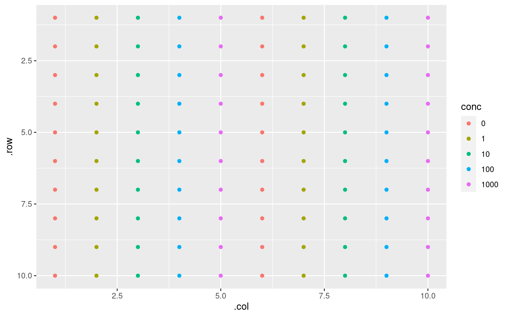

[gplate](https://github.com/KaiAragaki/gplate) introduces a **g**rammar of **plate**s.

Microwell plates are usually arranged in visually meaningful ways but are not tidy data, and their manipulation to and from a tidy form is cumbersome. gplate is aimed at both developers that create packages that ingest and produce plate data as well as for interactive operating on microwell data.

To this end, gplate introduces a succinct but powerful language. The 'shape' of the microwell data is described in a layers known as 'sections' that allow for the fractal-like layouts that are common when plating things.

This sounds all very theoretical, so let's dive in with a quick example. More information can be found on the [pkgdown](https://kaiaragaki.github.io/gplate/).

``` r
library(gplate)
```

A `gplate` is not very exciting on its own:

``` r
gp <- gp(rows = 16, cols = 24)
gp
```


                                 24
        ________________________________________________
       | ◯ ◯ ◯ ◯ ◯ ◯ ◯ ◯ ◯ ◯ ◯ ◯ ◯ ◯ ◯ ◯ ◯ ◯ ◯ ◯ ◯ ◯ ◯ ◯
       | ◯ ◯ ◯ ◯ ◯ ◯ ◯ ◯ ◯ ◯ ◯ ◯ ◯ ◯ ◯ ◯ ◯ ◯ ◯ ◯ ◯ ◯ ◯ ◯
       | ◯ ◯ ◯ ◯ ◯ ◯ ◯ ◯ ◯ ◯ ◯ ◯ ◯ ◯ ◯ ◯ ◯ ◯ ◯ ◯ ◯ ◯ ◯ ◯
       | ◯ ◯ ◯ ◯ ◯ ◯ ◯ ◯ ◯ ◯ ◯ ◯ ◯ ◯ ◯ ◯ ◯ ◯ ◯ ◯ ◯ ◯ ◯ ◯
       | ◯ ◯ ◯ ◯ ◯ ◯ ◯ ◯ ◯ ◯ ◯ ◯ ◯ ◯ ◯ ◯ ◯ ◯ ◯ ◯ ◯ ◯ ◯ ◯
       | ◯ ◯ ◯ ◯ ◯ ◯ ◯ ◯ ◯ ◯ ◯ ◯ ◯ ◯ ◯ ◯ ◯ ◯ ◯ ◯ ◯ ◯ ◯ ◯
       | ◯ ◯ ◯ ◯ ◯ ◯ ◯ ◯ ◯ ◯ ◯ ◯ ◯ ◯ ◯ ◯ ◯ ◯ ◯ ◯ ◯ ◯ ◯ ◯
       | ◯ ◯ ◯ ◯ ◯ ◯ ◯ ◯ ◯ ◯ ◯ ◯ ◯ ◯ ◯ ◯ ◯ ◯ ◯ ◯ ◯ ◯ ◯ ◯
    16 | ◯ ◯ ◯ ◯ ◯ ◯ ◯ ◯ ◯ ◯ ◯ ◯ ◯ ◯ ◯ ◯ ◯ ◯ ◯ ◯ ◯ ◯ ◯ ◯
       | ◯ ◯ ◯ ◯ ◯ ◯ ◯ ◯ ◯ ◯ ◯ ◯ ◯ ◯ ◯ ◯ ◯ ◯ ◯ ◯ ◯ ◯ ◯ ◯
       | ◯ ◯ ◯ ◯ ◯ ◯ ◯ ◯ ◯ ◯ ◯ ◯ ◯ ◯ ◯ ◯ ◯ ◯ ◯ ◯ ◯ ◯ ◯ ◯
       | ◯ ◯ ◯ ◯ ◯ ◯ ◯ ◯ ◯ ◯ ◯ ◯ ◯ ◯ ◯ ◯ ◯ ◯ ◯ ◯ ◯ ◯ ◯ ◯
       | ◯ ◯ ◯ ◯ ◯ ◯ ◯ ◯ ◯ ◯ ◯ ◯ ◯ ◯ ◯ ◯ ◯ ◯ ◯ ◯ ◯ ◯ ◯ ◯
       | ◯ ◯ ◯ ◯ ◯ ◯ ◯ ◯ ◯ ◯ ◯ ◯ ◯ ◯ ◯ ◯ ◯ ◯ ◯ ◯ ◯ ◯ ◯ ◯
       | ◯ ◯ ◯ ◯ ◯ ◯ ◯ ◯ ◯ ◯ ◯ ◯ ◯ ◯ ◯ ◯ ◯ ◯ ◯ ◯ ◯ ◯ ◯ ◯
       | ◯ ◯ ◯ ◯ ◯ ◯ ◯ ◯ ◯ ◯ ◯ ◯ ◯ ◯ ◯ ◯ ◯ ◯ ◯ ◯ ◯ ◯ ◯ ◯

    Start corner: tl

    Plate dimensions: 16 x 24

An important utility of gplate is the ability to plot your efforts along the way to tidying your data to ensure you're on the right track. This will make a little bit more sense later, but as a baseline, let's plot plate as is:

``` r
gp_plot(gp)
```


You'll notice the plot has a '.sec' legend. This stands for the current 'section' of the plot. We'll get to what that can do for you next, but for now just know that at baseline, the whole plate is considered a single 'section'.

Let's add our own sections. Why would you want to add a section? Consider you plated half a plate with one drug and half with the other. We could do something like this to illustrate that:

``` r
with_drug <- gp |>
  gp_sec("drug", ncol = 12, nrow = 16, labels = c("Drug A", "Drug B"))
gp_plot(with_drug, drug)
```


Sections define 'blocks' in our plates. But it isn't just for plotting (though I find this quite useful for plotting when writing protocols) - in the [Using glate to wrangle plate data](https://kaiaragaki.github.io/gplate/articles/gp_for_data.html) vignette, you'll see that you can easily provide data as an argument to `gp`. By describing the data through this 'plotting' method, tidying becomes trivial.

An example. Suppose we have data that look like these:

``` r
my_data <- matrix(1:100, nrow = 10, ncol = 10)
my_data
```

          [,1] [,2] [,3] [,4] [,5] [,6] [,7] [,8] [,9] [,10]
     [1,]    1   11   21   31   41   51   61   71   81    91
     [2,]    2   12   22   32   42   52   62   72   82    92
     [3,]    3   13   23   33   43   53   63   73   83    93
     [4,]    4   14   24   34   44   54   64   74   84    94
     [5,]    5   15   25   35   45   55   65   75   85    95
     [6,]    6   16   26   36   46   56   66   76   86    96
     [7,]    7   17   27   37   47   57   67   77   87    97
     [8,]    8   18   28   38   48   58   68   78   88    98
     [9,]    9   19   29   39   49   59   69   79   89    99
    [10,]   10   20   30   40   50   60   70   80   90   100

Suppose we also know that each quadrant of the (strangely, 10x10) plate is a different drug, and that in each quadrant, each column represents a concentration of drug, increasing from 0 to 1000 from left to right.

Ironically, the best way to visualize what I mentioned above is *with* gplate.

Like above, we can annotate each section with a drug:

``` r
with_drug <- my_data |>
  as_gp() |>
  gp_sec(name = "drug", nrow = 5, ncol = 5, labels = c("A", "B", "C", "D"))
gp_plot(with_drug, drug)
```


But to annotate drug concentrations, we should note that *sections can have sections*. This is the fractal nature I spoke of at the beginning.

``` r
with_conc <- with_drug |>
  gp_sec(name = "conc", ncol = 1, labels = c(0, 1, 10, 100, 1000))

gp_plot(with_conc, conc)
```



It's worth noting that our other sections (in this case, just `drug`) can still be plotted too:

``` r
gp_plot(with_conc, drug)
```


Tidying these data is simple. Now the plate is ready, it can be served:

``` r
gp_serve(with_conc)
```

    # A tibble: 100 × 5
        .row  .col value drug  conc 
       <int> <int> <int> <fct> <fct>
     1     1     1     1 A     0    
     2     1     6    51 B     0    
     3     6     1     6 C     0    
     4     6     6    56 D     0    
     5     2     1     2 A     0    
     6     2     6    52 B     0    
     7     7     1     7 C     0    
     8     7     6    57 D     0    
     9     3     1     3 A     0    
    10     3     6    53 B     0    
    # ℹ 90 more rows

This scratches just the surface of what interesting and useful things can be done with `gplate`. For more information, check out the [pkgdown](https://kaiaragaki.github.io/gplate/).
