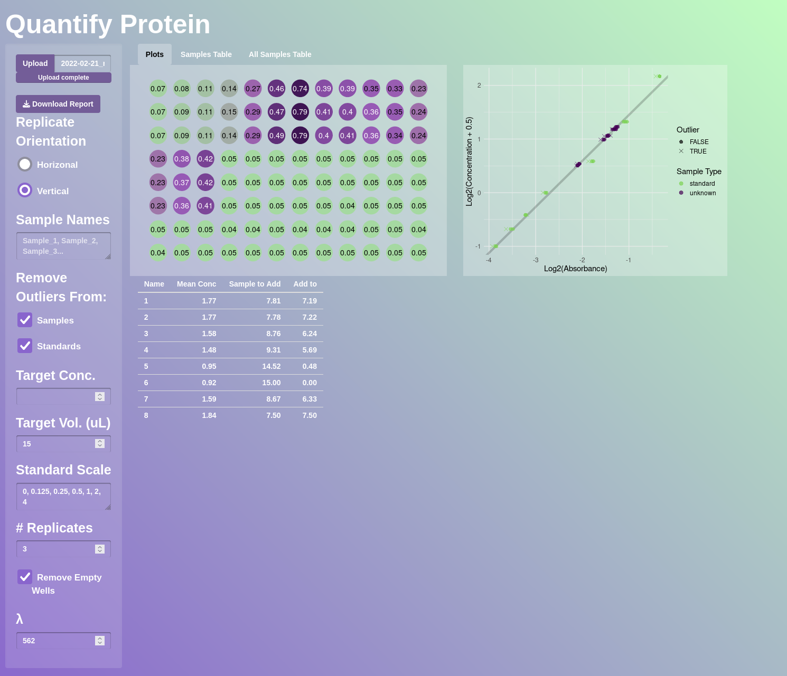
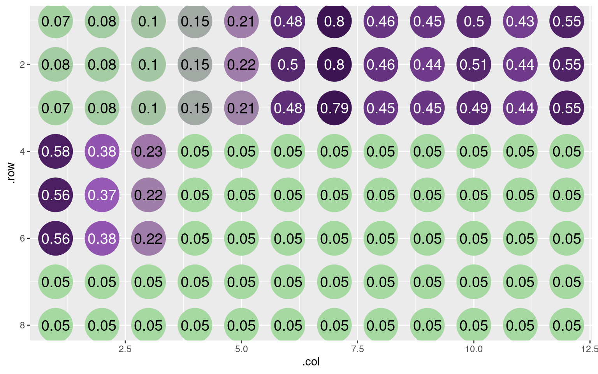
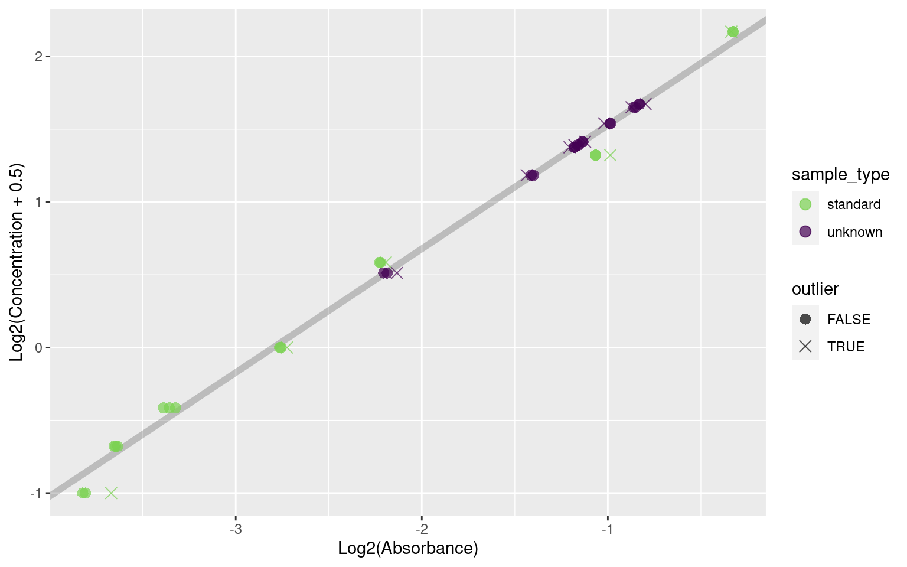

[qp](https://kaiaragaki.github.io/qp/index.html) is a toolkit for working with MicroBCA assays and their analyses. It leverages work from some of my other projects, like `gplate` and `mop`.

The old process was to slice and dice data in Excel. While it certainly *worked*, it was subjective (outliers removed by eye), tedious (the same analysis every time), and was a leak in the 'flow of data', as excel-based data munging often is: no one knows *how* (and certainly not *why*) you did something, only that something *was done*.

# Shiny App

qp was created as an attempt to fix all these issues. Furthermore, to facilitate its use, I've used it in a [Shiny app](https://kai-a.shinyapps.io/qp_shiny/). However, it's a fully (perhaps even more) capable package without a GUI.



# Usage

``` r
library(qp)
head(absorbances) # Some example absorbances
```

      .row .col   .abs sample_type index
    1    1    1 0.0707    standard     1
    2    2    1 0.0786    standard     1
    3    3    1 0.0714    standard     1
    4    1    2 0.0795    standard     2
    5    2    2 0.0799    standard     2
    6    3    2 0.0805    standard     2

To get a feel for what it might look like on the bench:

``` r
qp_plot_plate(absorbances)
```



``` r
# These arguments are the defaults
out <- qp(
  absorbances,
  replicate_orientation = "v",
  sample_names = paste0("Sample_", 1:8),
  remove_empty = TRUE,
  ignore_outliers = "all",
  standard_scale = c(0, 2^((2:7) - 5)),
  n_replicates = 3,
  wavelength = 562
)
```

    Warning: `sample_type` contains values other than `standard` and `unknown`
    ! These values may be ignored downstream!
    `sample_type` contains values other than `standard` and `unknown`
    ! These values may be ignored downstream!

``` r
out
```

    $fit

    Call:
    stats::lm(formula = .log2_conc ~ .log2_abs, data = fit_data)

    Coefficients:
    (Intercept)    .log2_abs  
          2.378        0.850  


    $qp
    # A tibble: 45 × 13
        .row  .col   .abs sample_type index .conc .is_outlier  .mean .log2_abs
       <int> <dbl>  <dbl> <fct>       <dbl> <dbl> <lgl>        <dbl>     <dbl>
     1     1     1 0.0707 standard        1 0     FALSE       0.0710     -3.82
     2     2     1 0.0786 standard        1 0     TRUE        0.0710     -3.67
     3     3     1 0.0714 standard        1 0     FALSE       0.0710     -3.81
     4     1     2 0.0795 standard        2 0.125 FALSE       0.0800     -3.65
     5     2     2 0.0799 standard        2 0.125 FALSE       0.0800     -3.65
     6     3     2 0.0805 standard        2 0.125 FALSE       0.0800     -3.63
     7     1     3 0.0999 standard        3 0.25  FALSE       0.0977     -3.32
     8     2     3 0.0955 standard        3 0.25  FALSE       0.0977     -3.39
     9     3     3 0.0976 standard        3 0.25  FALSE       0.0977     -3.36
    10     1     4 0.151  standard        4 0.5   TRUE        0.148      -2.72
    # ℹ 35 more rows
    # ℹ 4 more variables: .pred <dbl>, .pred_conc <dbl>, .pred_conc_mean <dbl>,
    #   .sample_name <chr>

We can make a plot of the fit:

``` r
qp_plot_standards(out)
```



We can also calculate dilutions:

``` r
out |>
  qp_summarize() |>
  qp_dilute()
```

    `target_conc` is missing, using lowest sample concentration

    # A tibble: 15 × 7
       .sample_name sample_type .pred_conc_mean sample_to_add  add_to .target_conc
       <chr>        <fct>                 <dbl>         <dbl>   <dbl>        <dbl>
     1 Standard 1   standard             0.0493        282    -267           0.926
     2 Standard 2   standard             0.107         129.   -114.          0.926
     3 Standard 3   standard             0.220          63.2   -48.2         0.926
     4 Standard 4   standard             0.522          26.6   -11.6         0.926
     5 Standard 5   standard             0.902          15.4    -0.4         0.926
     6 Standard 6   standard             2.27            6.11    8.89        0.926
     7 Standard 7   standard             3.79            3.67   11.3         0.926
     8 Sample_1     unknown              2.16            6.42    8.58        0.926
     9 Sample_2     unknown              2.12            6.54    8.46        0.926
    10 Sample_3     unknown              2.41            5.77    9.23        0.926
    11 Sample_4     unknown              2.10            6.63    8.37        0.926
    12 Sample_5     unknown              2.64            5.26    9.74        0.926
    13 Sample_6     unknown              2.69            5.17    9.83        0.926
    14 Sample_7     unknown              1.77            7.84    7.16        0.926
    15 Sample_8     unknown              0.926          15       0           0.926
    # ℹ 1 more variable: .target_vol <dbl>

There's plenty more that can be done (particularly with less typical workflows) - see the [vignette](https://kaiaragaki.github.io/qp/articles/quantifying-protein-with-qp.html) for more information
