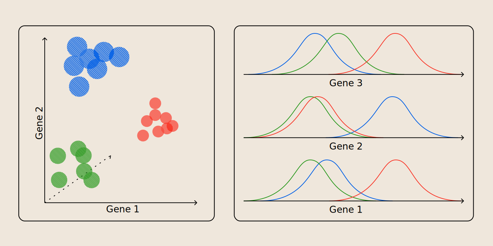
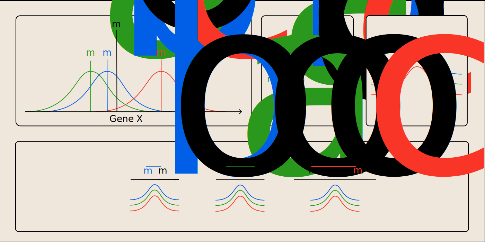
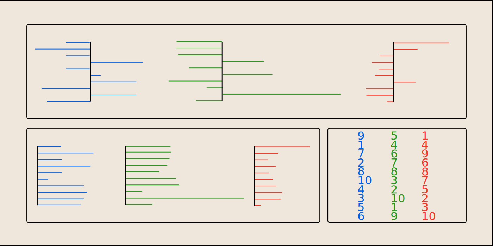
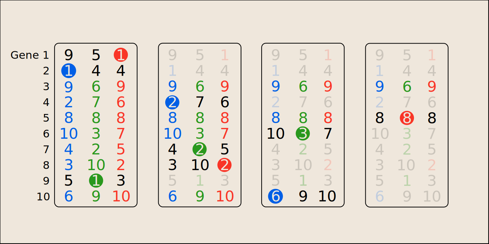
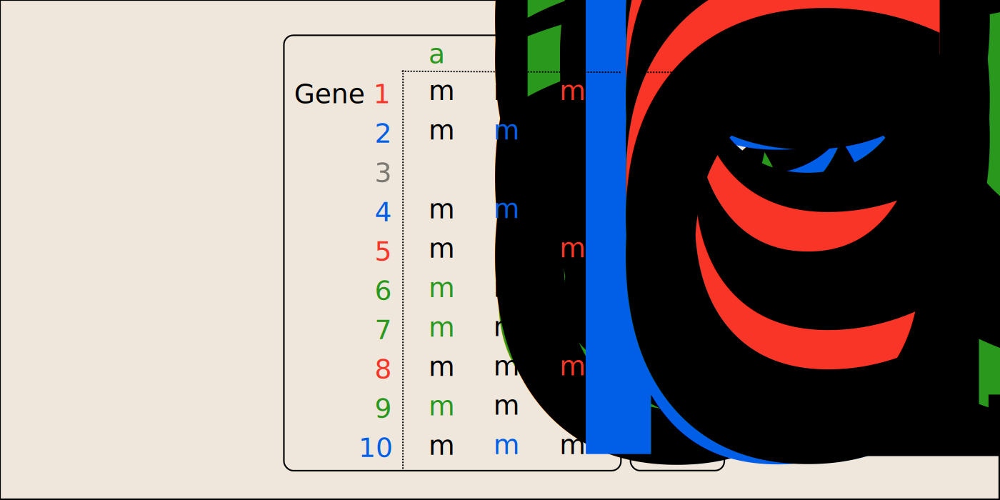
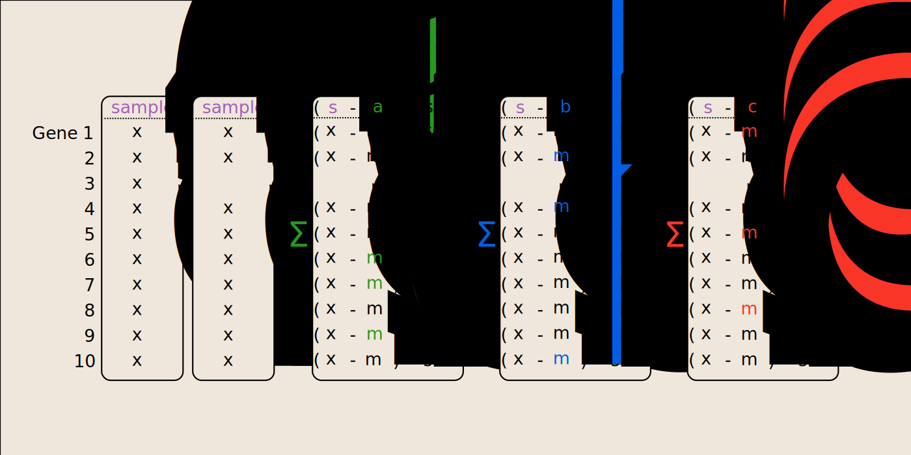
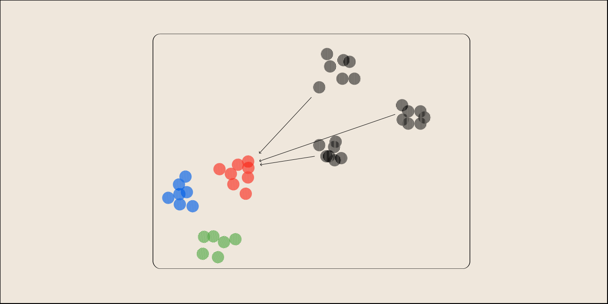
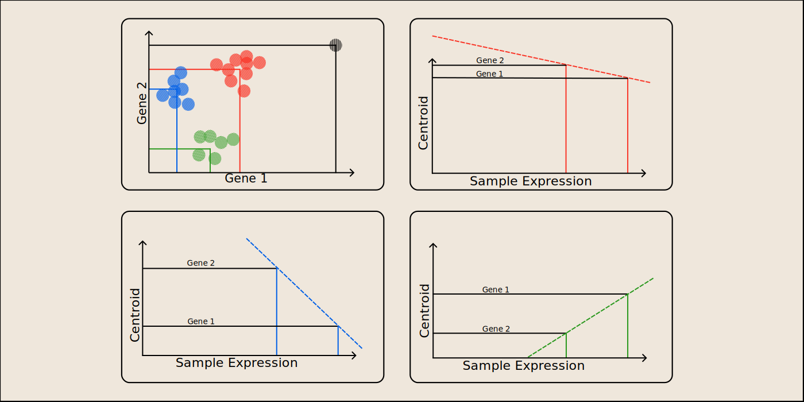

# Introduction

In this post, I'm going to give a brief overview into the *theory* and *mechanics* of my refresh of the classification package `ClaNC`, `reclanc`. The intended audience is those who know just a little about gene expression data and just a little about statistics. If you're confused, feel free to reach out! 

Usage of `reclanc` won't be covered here. I'll be writing a separate vignette - stay tuned.

# What is classification, and why do it?

Classification, in essence, requires two steps:

1. Find the distinguishing features of each of the classes in your pre-labelled/clustered data ('fitting')
2. Use these distinguishing features to classify samples from other datasets that do not have these labels ('predicting')

Both of these steps provide utility.

For the first step, let's imagine you have tumors from cancer patients that responded to a drug and those that did not respond to a drug. We might use those as our 'labels' for each class - responders and non-responders. We could use a classifier to extract distinguishing features about each one of our classes. In the case of this package, these features refer to genes, and what distinguishes them from class to class is their expression levels. We can look at what features the classifier took and gain insight into the biology of these responders - maybe even forming a hypothesis for the mechanism by which these responders respond. The extent which the features extracted represent anything useful depends on the intepretability of the model, of which ClaNC is highly interpretable.

The utility of the second step is more straightforward. If you want to apply the knowledge of a given subtype to a new set of data, classification is incredibly useful here. For instance, imagine you have developed a classifier that can help you predict whether a cancer patient will respond to a drug based on expression from their tumor. Being able to classify which class the new patient's tumor falls into provides you with actionable information as to how to treat the patient.

(Aside: not all classifiers can classify new, single samples - some require context of additional samples around them. However, ClaNC doesn't need this and can classify a single new sample (sometimes called a 'single sample classifier').)

# What is ClaNC?

ClaNC both creates classifiers (fits) as well as uses the classifiers to assign new samples to a class (predicts). It is a nearest-centroid classifier. We'll get into the details later, but as a brief summary, it means it tries to find the average, distinguishing features of a given class (step 1), and then uses that average as a landmark to compare new samples to (step 2).

ClaNC was originally described by Alan Dabney [here](https://academic.oup.com/bioinformatics/article/21/22/4148/194954). Other nearest-centroid classifiers have existed (like, for instance, PAM), but ClaNC distinguishes itself by tending to be more accurate and sensitive than PAM. If you're interested in why and how, I highly recommend you to look through the paper linked. 

# How does it work?

## Fitting

Our first step provide the algorithm with examples of what each class looks like so it can extract the features that distinguish one class from another. These 'examples' can come from some external phenotype (such as our responder/non-responder example from above) or from the data themselves (such as clusters from after doing, say, k-means clustering). Regardless, the input should be expression data that has been labeled with some kind of class (**Figure 1, left**).

**Figure 1, Left:** Our samples, colored by class, floating in N-dimensional space. **Right:** Each dimension separated from one another

The first assumption we make is that we can treat each gene independently. While this might not be exactly true in reality, it greatly simplifies the problem by allowing us to deal with each gene one at a time (**Figure 1, right**). Despite this simplification, it also works pretty well.

For each gene, we calculate the overall mean, as well as the mean within each class (**Figure 2, top left**). We then find the distance between each class mean and the overall mean (**Figure 2, top middle**) and the pooled standard deviation for the gene (**Figure 2, top right**). Dividing the distance by the pooled standard deviation, we get, essentially, a t-statistic.

**Figure 2, Top left:** The expression of a gene for each given class, with class means denoted by *ma*, *mb*, and *mc*, and the overall mean as *mo*. **Top middle:** distances between the class and overall means. **Top right:** Pooled standard deviantions are calculated for each gene. **Bottom:** dividing each class distance by the pooled standard deviation 

We repeat this calculation for every gene (**Figure 3, top**), then take the absolute value of each statistic (**Figure 3, bottom left**) and rank them *per-class* (that is, each class has a #1, #2, etc) (**Figure 3, bottom right**).

**Figure 3, Top:** t-statistics for each class (color) and each gene (row). **Bottom left:** absolute value of the t-statistics. **Bottom right:** classwise rank of absolute value t-statistics 

One thing to note is what Dabney calls 'active genes'. An 'active gene' is a gene that has been selected to be a distinguishing feature for a given class. At the outset, you can select how many active genes you want per class (and it needn't be the same number of genes per class). 

One thing that sets ClaNC apart from other nearest-centroid classifiers is that it only lets each gene be 'used' as a distinguishing feature once. That is, it cannot be used in multiple classes. Because of this, the classes 'compete' with one another to see who gets what gene. It's based on the class-rank of the gene (using the underlying absolute value t-statistic as a tie-breaker) as well as if a class needs more 'active genes' or if it already has all that it needs.

The game of gene selection goes like this:

1. Each class tries to select its highest rated gene. In the case of **Figure 4, panel 1**, every class gets its desired gene. These genes are then taken out of future rounds (since each gene can only be in one class, a restriction we mentioned above).
2. Classes continue to select their next highest rated gene, so long as there isn't and conflict (**panel 2**).
3. If a class can't get its next highest rated gene (in this case, blue can't get 3 because it's been taken by red in a previous round), then it chooses its next best available choice (all the way at 6 for blue) (**panel 3**)
4. If there's a tie, it is typically resolved by looking at the underlying t-statistics. Whichever class has the larger absolute t-statistic wins the gene. However, in this case, suppose we set each class to only want 3 active genes. In that case, both blue and green have met their quota, and red wins by default (**panel 4**). 

**Figure 4, Panel 1:** All classes select their top rated gene. **Panel 2:** Classes continue to select their next highest rated gene. **Panel 3:** Blue selects its next best rank since previous ranks were taken. **Panel 4:** Despite a tie, since number of active genes = 3, red wins.

Once all genes have been selected, the rest are tossed - they're unneeded for defining the centroid (**Figure 5, gene 3**). If a given class 'won' a gene, it uses its class mean as a value for that gene (**Figure 5, colored means**). Otherwise, it uses the overall mean (**Figure 5, black means**). The pooled standard deviations are also brought along. These are our centroids!

**Figure 5:** Centroids, at long last.

## Predicting
Now we have created our centroids, we might be interested in applying them to classify future samples of unknown class.

Suppose we have a new sample that we have expression data of (**Figure 6, panel 1**). The genes that are not included in the centroids will have no bearing on the classification, so we can remove them (this might be a feature: perhaps an inexpensive assay is developed that *only* measures the expression of the centroid genes) (**panel 2**).

### Distance-based metric

For every class, and every gene in that class, find the distance between the class centroid's mean and the new sample's mean and square it (**panels 3, 4, 5; numerator**) and divide by the pooled standard deviation we kept in our centroids (**panels 3, 4, 5; denominator**). 

**Figure 6:** Calculating the distance between centroids and a new sample

Let's think about these new statistics and what they mean. If the sample gene's expression is very close to a class's expression, the statistic will be very small (scaled by how much it tends to deviate - we shouldn't punish expression from being far from the mean if it's fairly typical). If a sample is very similar to a given class, we expect all of these scores to be quite small. To this end, we take the sum of all the scores for a given class and compare the sums across all classes. The one with the smallest score is the most similar class, to which the sample gets assigned. Note that it makes sense to square the distance between the sample's expression and the centroid's expression, because we don't want a sample that is 'equally wrong on both sides' to average out and get flagged as very similar.

### Correlation-based metric

The distance-based metric classification can fail, such as when samples are scaled differently or the expression comes from a different sequencing platform. Consider a particularly pathological example shown in **Figure 7**, where the colored dots represent the training samples used to create our centroids, and the black dots represent new samples we want to classify. Despite our new samples showing three distinct clusters that appear to have a similar pattern to our training data clusters, they will all be called 'red' because it is the closest cluster.

**Figure 7:** When distance metrics fail

One way around this is to look at the *correlation* between centroid expressions and the new sample's expression. If the centroid is related with the sample but for a difference in scaling, we expect a positive correlation between the two, such as shown between the unknown sample and the green centroid in **Figure 8**.

**Figure 8:** Classification through correlation

(For the sake of illustration, I've simplified the centroids to only use their class means for all genes, and don't consider anything about 'winning' genes - the principle is the same though.)

# How is reclanc different from ClaNC?

You may have noticed that Dabney already created an R package. However, for the life of me I couldn't track down the original source anywhere, in large part due to [link rot](https://www.pewresearch.org/data-labs/2024/05/17/when-online-content-disappears/)

Fortunately, some version of it was saved in a different project known as [SAKE](https://github.com/naikai/sake/blob/master/R/clanc.R), and I have adapted the source from there for this package - though it has been heavily modified.

Besides its mere existence, `reclanc` also differs from ClaNC in how it integrates with surrounding ecosystems. While ClaNC preferred just matrix inputs, `reclanc` can take a `SummarizedExperiment`, `ExpressionSet`, `data.frame`/`tibble`, or, of course, a `matrix`.

`reclanc` also integrates nicely with `tidymodels`, and can take a `recipe` as input. While originally a specific resampling function was built into ClaNC, integration with `tidymodels` allows resampling to be handled by `rsample`, and previously baked-in active gene optimization can be delegated to `tune` and `yardstick`.

Finally, `reclanc` allows for prediction based on centroid *correlation*, rather than centroid *distance*. This is particularly useful for samples that might be scaled differently, or come from different sequencing platforms.
